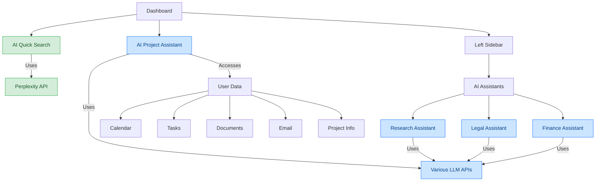
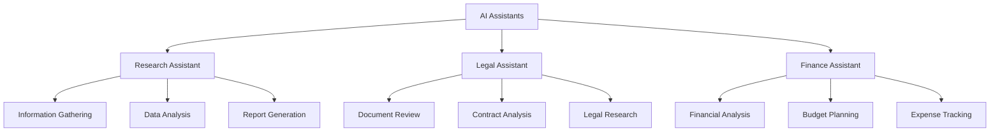

# AI Integration

*Last Updated: March 12, 2025*

This document provides a comprehensive overview of the AI integration in the CollabFlow project, including AI components, services, and implementation details.

## Table of Contents
- [AI Components Architecture](#ai-components-architecture)
- [Perplexity Integration](#perplexity-integration)
- [AI Assistant Implementation](#ai-assistant-implementation)
- [Database Schema](#database-schema)
- [Future AI Enhancements](#future-ai-enhancements)

---

## AI Components Architecture



### Key Components

- **AIQuickSearch**: Provides quick search functionality using Perplexity API
- **AIProjectAssistant**: Context-aware assistant for project management
- **Specialized AI Assistants**: Research, Legal, and Finance assistants (planned)

---

## Perplexity Integration

The CollabFlow project integrates with the Perplexity API for AI-powered search and documentation capabilities.

### Implementation

```typescript
// Example of Perplexity API integration
import { usePerplexitySearch } from '@/hooks/usePerplexitySearch';

function AIQuickSearch() {
  const { search, results, isLoading, error } = usePerplexitySearch();
  const [query, setQuery] = useState('');
  
  const handleSearch = async (e) => {
    e.preventDefault();
    await search(query);
  };
  
  return (
    <div className="ai-quick-search">
      <form onSubmit={handleSearch}>
        <input
          type="text"
          value={query}
          onChange={(e) => setQuery(e.target.value)}
          placeholder="Search with AI..."
          className="w-full px-4 py-2 rounded-md border"
        />
        <button type="submit" disabled={isLoading}>
          {isLoading ? 'Searching...' : 'Search'}
        </button>
      </form>
      
      {error && <div className="error">{error}</div>}
      
      <div className="results">
        {results.map((result, index) => (
          <div key={index} className="result-item">
            <h3>{result.title}</h3>
            <p>{result.snippet}</p>
            <a href={result.url} target="_blank" rel="noopener noreferrer">
              Learn more
            </a>
          </div>
        ))}
      </div>
    </div>
  );
}
```

### Custom Hook

```typescript
// Custom hook for Perplexity search
function usePerplexitySearch() {
  const [results, setResults] = useState([]);
  const [isLoading, setIsLoading] = useState(false);
  const [error, setError] = useState(null);
  
  const search = useCallback(async (query) => {
    setIsLoading(true);
    setError(null);
    
    try {
      const result = await use_mcp_tool({
        server_name: 'perplexity-mcp',
        tool_name: 'search',
        arguments: {
          query,
          detail_level: "normal"
        }
      });
      
      setResults(result);
      return result;
    } catch (err) {
      setError(err.message);
      return [];
    } finally {
      setIsLoading(false);
    }
  }, []);
  
  return { search, results, isLoading, error };
}
```

---

## AI Assistant Implementation

The AI Project Assistant provides context-aware assistance for project management tasks.

### Features

- **Task Recommendations**: Suggests tasks based on project context
- **Calendar Management**: Helps organize and schedule events
- **Document Analysis**: Analyzes project documents for insights
- **Context-Aware Responses**: Tailors responses based on user data

### Implementation

```typescript
// Example of AI Project Assistant implementation
import { useAIMessages } from '@/hooks/useAIMessages';

function AIProjectAssistant() {
  const { messages, sendMessage, isLoading } = useAIMessages('project');
  const [input, setInput] = useState('');
  
  const handleSendMessage = async (e) => {
    e.preventDefault();
    if (!input.trim()) return;
    
    await sendMessage(input);
    setInput('');
  };
  
  return (
    <div className="ai-project-assistant">
      <div className="messages">
        {messages.map((message, index) => (
          <div
            key={index}
            className={`message ${message.is_user ? 'user' : 'assistant'}`}
          >
            <div className="message-content">{message.content}</div>
          </div>
        ))}
        {isLoading && <div className="loading">AI is thinking...</div>}
      </div>
      
      <form onSubmit={handleSendMessage}>
        <input
          type="text"
          value={input}
          onChange={(e) => setInput(e.target.value)}
          placeholder="Ask your AI assistant..."
          className="w-full px-4 py-2 rounded-md border"
        />
        <button type="submit" disabled={isLoading || !input.trim()}>
          Send
        </button>
      </form>
    </div>
  );
}
```

### Custom Hook

```typescript
// Custom hook for AI messages
function useAIMessages(assistantType = 'personal') {
  const supabase = useSupabaseClient();
  const [messages, setMessages] = useState([]);
  const [isLoading, setIsLoading] = useState(false);
  
  // Fetch messages on component mount
  useEffect(() => {
    const fetchMessages = async () => {
      const { data, error } = await supabase
        .from('ai_messages')
        .select('*')
        .eq('assistant_type', assistantType)
        .order('created_at', { ascending: true });
        
      if (error) {
        console.error('Error fetching messages:', error);
        return;
      }
      
      setMessages(data || []);
    };
    
    fetchMessages();
  }, [supabase, assistantType]);
  
  // Send a message to the AI assistant
  const sendMessage = async (content) => {
    if (!content.trim()) return;
    
    setIsLoading(true);
    
    try {
      // Insert user message
      const { data: userMessage, error: userError } = await supabase
        .from('ai_messages')
        .insert([
          {
            content,
            is_user: true,
            assistant_type: assistantType
          }
        ])
        .select();
        
      if (userError) throw userError;
      
      // Update local state
      setMessages((prev) => [...prev, userMessage[0]]);
      
      // Get AI response
      const aiResponse = await getAIResponse(content, assistantType);
      
      // Insert AI message
      const { data: aiMessage, error: aiError } = await supabase
        .from('ai_messages')
        .insert([
          {
            content: aiResponse,
            is_user: false,
            assistant_type: assistantType
          }
        ])
        .select();
        
      if (aiError) throw aiError;
      
      // Update local state
      setMessages((prev) => [...prev, aiMessage[0]]);
      
      return aiMessage[0];
    } catch (error) {
      console.error('Error sending message:', error);
      throw error;
    } finally {
      setIsLoading(false);
    }
  };
  
  return { messages, sendMessage, isLoading };
}

// Helper function to get AI response
async function getAIResponse(userMessage, assistantType) {
  try {
    const result = await use_mcp_tool({
      server_name: 'perplexity-mcp',
      tool_name: 'chat_perplexity',
      arguments: {
        message: userMessage
      }
    });
    
    return result.response || "I'm sorry, I couldn't process your request.";
  } catch (error) {
    console.error('Error getting AI response:', error);
    return "I'm having trouble connecting to my knowledge base. Please try again later.";
  }
}
```

---

## Database Schema

The AI messages are stored in a dedicated table:

```sql
create table ai_messages (
  id uuid default gen_random_uuid() primary key,
  content text not null,
  is_user boolean not null,
  assistant_type text not null default 'personal',
  created_at timestamptz default now(),
  user_id uuid references auth.users not null
);

-- RLS Policies
alter table ai_messages enable row level security;

create policy "Users can view their own messages"
  on ai_messages for select
  using (auth.uid() = user_id);

create policy "Users can insert their own messages"
  on ai_messages for insert
  with check (auth.uid() = user_id);
```

---

## MCP Integration

The CollabFlow project uses Model Context Protocol (MCP) servers for AI integration.

### Available MCP Servers

The project currently uses the following MCP servers:

1. **memory** - For persistent knowledge storage
2. **perplexity-mcp** - For AI-powered search and documentation
3. **sequentialthinking** - For structured problem-solving

### Perplexity MCP Usage

```typescript
// Search for information
const searchResults = await use_mcp_tool({
  server_name: 'perplexity-mcp',
  tool_name: 'search',
  arguments: {
    query: "Next.js App Router best practices",
    detail_level: "normal"
  }
});

// Get documentation for a specific technology
const docs = await use_mcp_tool({
  server_name: 'perplexity-mcp',
  tool_name: 'get_documentation',
  arguments: {
    query: "Supabase Row Level Security",
    context: "React application"
  }
});
```

### Memory Graph Usage

```typescript
// Store information in memory graph
await use_mcp_tool({
  server_name: 'memory',
  tool_name: 'create_entities',
  arguments: {
    entities: [
      {
        name: "EntityName",
        entityType: "EntityType",
        observations: [
          "Observation 1",
          "Observation 2"
        ]
      }
    ]
  }
});

// Retrieve information from memory graph
const result = await use_mcp_tool({
  server_name: 'memory',
  tool_name: 'search_nodes',
  arguments: {
    query: "search term"
  }
});
```

### Sequential Thinking

```typescript
// Break down a complex problem
const analysis = await use_mcp_tool({
  server_name: 'sequentialthinking',
  tool_name: 'sequentialthinking',
  arguments: {
    thought: "Initial analysis of the problem...",
    nextThoughtNeeded: true,
    thoughtNumber: 1,
    totalThoughts: 5
  }
});
```

---

## Future AI Enhancements

### Specialized AI Assistants



1. **Research Assistant**
   - Information gathering and analysis
   - Data visualization
   - Report generation

2. **Legal Assistant**
   - Document drafting and review
   - Contract analysis
   - Legal research

3. **Finance Assistant**
   - Financial analysis
   - Budget planning
   - Expense tracking

### Enhanced Context Awareness

- **User Behavior Analysis**: Learn from user interactions
- **Project Context Understanding**: Understand project goals and requirements
- **Personalized Recommendations**: Tailor recommendations based on user preferences

### Advanced AI Features

- **Predictive Task Management**: Predict task completion times and dependencies
- **Intelligent Scheduling**: Optimize calendar based on priorities and deadlines
- **Document Generation**: Generate reports, summaries, and documentation
