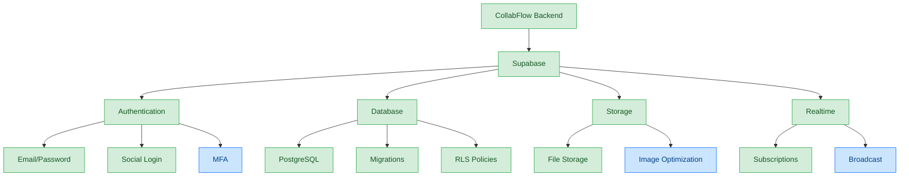
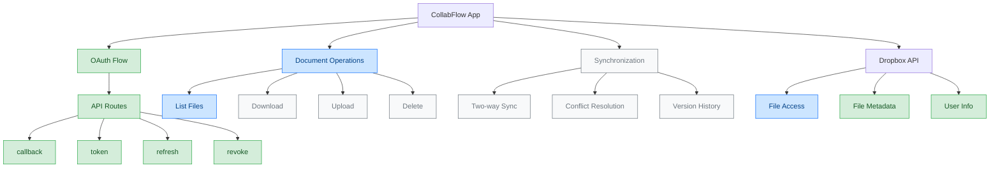

# Backend Architecture

*Last Updated: March 14, 2025*

This document provides a comprehensive overview of the CollabFlow backend architecture, database schema, and API integrations.

## Table of Contents
- [Supabase Integration](#supabase-integration)
- [Database Schema](#database-schema)
- [Authentication](#authentication)
- [API Implementation](#api-implementation)
- [External Integrations](#external-integrations)
- [Security Considerations](#security-considerations)

---

## Supabase Integration



### Key Features

- **Authentication**: Email/password and social login options with MFA support
- **Database**: PostgreSQL with proper schema design and migrations
- **Storage**: File storage for user uploads and attachments
- **Realtime**: Subscriptions for live updates to tasks and events

### Database Migration Guide

When applying migrations to your Supabase database:

1. **Local Development**:
   ```bash
   supabase migration new migration_name
   ```

2. **Edit the migration file** in `supabase/migrations/[timestamp]_migration_name.sql`

3. **Apply the migration locally**:
   ```bash
   supabase db reset
   ```

4. **Push to production**:
   ```bash
   supabase db push
   ```

5. **Verify the migration** in the Supabase dashboard

---

## Database Schema

### Calendar Events

```sql
create table calendar_events (
  id uuid default gen_random_uuid() primary key,
  title text not null,
  description text,
  date timestamptz not null,
  type text not null check (type in ('meeting', 'task', 'reminder')),
  created_at timestamptz default now(),
  user_id uuid references auth.users not null
);

-- RLS Policies
alter table calendar_events enable row level security;

create policy "Users can view their own events"
  on calendar_events for select
  using (auth.uid() = user_id);

create policy "Users can insert their own events"
  on calendar_events for insert
  with check (auth.uid() = user_id);
```

### Tasks

```sql
create table tasks (
  id uuid default gen_random_uuid() primary key,
  title text not null,
  description text,
  status text not null default 'todo' check (status in ('todo', 'in_progress', 'done')),
  priority text not null default 'medium' check (priority in ('low', 'medium', 'high')),
  due_date timestamptz,
  list_id uuid references task_lists(id),
  created_at timestamptz default now(),
  updated_at timestamptz default now(),
  user_id uuid references auth.users not null
);

-- RLS Policies
alter table tasks enable row level security;

create policy "Users can view their own tasks"
  on tasks for select
  using (auth.uid() = user_id);

create policy "Users can insert their own tasks"
  on tasks for insert
  with check (auth.uid() = user_id);
```

### Task Lists

```sql
create table task_lists (
  id uuid default gen_random_uuid() primary key,
  name text not null,
  color text not null default '#2f3c98',
  created_at timestamptz default now(),
  updated_at timestamptz default now(),
  user_id uuid references auth.users not null
);

-- RLS Policies
alter table task_lists enable row level security;

create policy "Users can view their own task lists"
  on task_lists for select
  using (auth.uid() = user_id);

create policy "Users can insert their own task lists"
  on task_lists for insert
  with check (auth.uid() = user_id);
```

### AI Messages

```sql
create table ai_messages (
  id uuid default gen_random_uuid() primary key,
  content text not null,
  is_user boolean not null,
  assistant_type text not null default 'personal',
  created_at timestamptz default now(),
  user_id uuid references auth.users not null
);

-- RLS Policies
alter table ai_messages enable row level security;

create policy "Users can view their own messages"
  on ai_messages for select
  using (auth.uid() = user_id);

create policy "Users can insert their own messages"
  on ai_messages for insert
  with check (auth.uid() = user_id);
```

### User Settings

```sql
create table user_settings (
  id uuid default gen_random_uuid() primary key,
  user_id uuid references auth.users not null unique,
  theme text default 'light' check (theme in ('light', 'dark', 'system')),
  notification_email boolean default true,
  notification_push boolean default true,
  notification_calendar_reminders boolean default true,
  notification_task_reminders boolean default true,
  date_format text default 'MM/DD/YYYY',
  time_format text default '12h',
  first_day_of_week integer default 0 check (first_day_of_week between 0 and 6),
  language text default 'en',
  created_at timestamptz default now(),
  updated_at timestamptz default now()
);

-- RLS Policies
alter table user_settings enable row level security;

create policy "Users can view their own settings"
  on user_settings for select
  using (auth.uid() = user_id);

create policy "Users can update their own settings"
  on user_settings for update
  using (auth.uid() = user_id);
```

### Projects

```sql
create table projects (
  id uuid default gen_random_uuid() primary key,
  name text not null,
  description text,
  color text not null default '#3B82F6',
  archived boolean default false,
  created_at timestamptz default now(),
  updated_at timestamptz default now(),
  user_id uuid references auth.users not null
);

-- RLS Policies
alter table projects enable row level security;

create policy "Users can view their own projects"
  on projects for select
  using (auth.uid() = user_id);
```

### Documents

```sql
-- Documents table for storing document metadata
create table documents (
  id uuid default gen_random_uuid() primary key,
  name text not null,
  description text,
  file_path text, -- Path in Supabase Storage
  dropbox_path text, -- Path in Dropbox
  size integer,
  mime_type text,
  is_synced boolean default false,
  last_synced timestamptz,
  external_url text, -- URL for accessing in Dropbox
  thumbnail_url text, -- URL for thumbnail preview
  version integer default 1,
  created_at timestamptz default now(),
  updated_at timestamptz default now(),
  user_id uuid references auth.users not null
);

-- Document versions table for tracking version history
create table document_versions (
  id uuid default gen_random_uuid() primary key,
  document_id uuid references documents not null,
  version integer not null,
  file_path text, -- Path in Supabase Storage
  dropbox_path text, -- Path in Dropbox
  size integer,
  created_at timestamptz default now(),
  user_id uuid references auth.users not null
);

-- Document-project associations
create table document_projects (
  id uuid default gen_random_uuid() primary key,
  document_id uuid references documents not null,
  project_id uuid references projects not null,
  created_at timestamptz default now(),
  user_id uuid references auth.users not null,
  unique(document_id, project_id)
);

-- Dropbox authentication tokens
create table dropbox_auth (
  id uuid default gen_random_uuid() primary key,
  user_id uuid references auth.users not null unique,
  access_token text, -- Encrypted in vault
  refresh_token text, -- Encrypted in vault
  account_id text,
  expires_at timestamptz,
  created_at timestamptz default now(),
  updated_at timestamptz default now()
);

-- Document sync log for tracking operations
create table document_sync_log (
  id uuid default gen_random_uuid() primary key,
  document_id uuid references documents not null,
  operation text not null check (operation in ('upload', 'download', 'delete', 'rename', 'move')),
  status text not null check (status in ('pending', 'success', 'failed')),
  error_message text,
  created_at timestamptz default now(),
  user_id uuid references auth.users not null
);

-- Database function to get documents by project
create or replace function get_documents_by_project(project_id uuid)
returns setof documents
language sql
security definer
as $$
  select d.*
  from documents d
  join document_projects dp on d.id = dp.document_id
  where dp.project_id = get_documents_by_project.project_id
  and dp.user_id = auth.uid()
  order by d.updated_at desc;
$$;

-- RLS Policies for documents
alter table documents enable row level security;

create policy "Users can view their own documents"
  on documents for select
  using (auth.uid() = user_id);

create policy "Users can insert their own documents"
  on documents for insert
  with check (auth.uid() = user_id);

create policy "Users can update their own documents"
  on documents for update
  using (auth.uid() = user_id);

create policy "Users can delete their own documents"
  on documents for delete
  using (auth.uid() = user_id);

-- RLS Policies for document_projects
alter table document_projects enable row level security;

create policy "Users can view their own document projects"
  on document_projects for select
  using (auth.uid() = user_id);

create policy "Users can insert their own document projects"
  on document_projects for insert
  with check (auth.uid() = user_id);

create policy "Users can delete their own document projects"
  on document_projects for delete
  using (auth.uid() = user_id);

-- RLS Policies for dropbox_auth
alter table dropbox_auth enable row level security;

create policy "Users can view their own Dropbox auth"
  on dropbox_auth for select
  using (auth.uid() = user_id);

create policy "Users can insert their own Dropbox auth"
  on dropbox_auth for insert
  with check (auth.uid() = user_id);

create policy "Users can update their own Dropbox auth"
  on dropbox_auth for update
  using (auth.uid() = user_id);

create policy "Users can delete their own Dropbox auth"
  on dropbox_auth for delete
  using (auth.uid() = user_id);
```

---

## Authentication

### Multi-Factor Authentication (MFA)

```sql
-- MFA table for storing TOTP secrets
create table mfa_factors (
  id uuid default gen_random_uuid() primary key,
  user_id uuid references auth.users not null,
  friendly_name text,
  factor_type text not null check (factor_type in ('totp')),
  status text not null check (status in ('unverified', 'verified')),
  created_at timestamptz default now(),
  updated_at timestamptz default now(),
  secret text not null
);

-- RLS Policies
alter table mfa_factors enable row level security;

create policy "Users can view their own MFA factors"
  on mfa_factors for select
  using (auth.uid() = user_id);

create policy "Users can insert their own MFA factors"
  on mfa_factors for insert
  with check (auth.uid() = user_id);
```

### Role-Based Access Control

```sql
-- Add role to users
alter table auth.users add column if not exists role text not null default 'user' check (role in ('user', 'admin'));

-- Function to get user role
create or replace function get_user_role()
returns text as $$
begin
  return (
    select role from auth.users
    where id = auth.uid()
  );
end;
$$ language plpgsql security definer;

-- Example policy using roles
create policy "Admins can view all tasks"
  on tasks for select
  using (get_user_role() = 'admin');
```

---

## API Implementation

### Next.js API Routes

```typescript
// Example API route for tasks
// app/api/tasks/route.ts
import { NextRequest, NextResponse } from 'next/server';
import { createRouteHandlerClient } from '@supabase/auth-helpers-nextjs';
import { cookies } from 'next/headers';
import { Database } from '@/lib/database.types';

export async function GET(request: NextRequest) {
  const supabase = createRouteHandlerClient<Database>({ cookies });
  
  // Check if user is authenticated
  const { data: { session } } = await supabase.auth.getSession();
  if (!session) {
    return NextResponse.json({ error: 'Unauthorized' }, { status: 401 });
  }
  
  // Get query parameters
  const searchParams = request.nextUrl.searchParams;
  const status = searchParams.get('status');
  const priority = searchParams.get('priority');
  
  // Build query
  let query = supabase.from('tasks').select('*');
  
  if (status && status !== 'all') {
    query = query.eq('status', status);
  }
  
  if (priority && priority !== 'all') {
    query = query.eq('priority', priority);
  }
  
  // Execute query
  const { data, error } = await query.order('due_date', { ascending: true });
  
  if (error) {
    return NextResponse.json({ error: error.message }, { status: 500 });
  }
  
  return NextResponse.json(data);
}

export async function POST(request: NextRequest) {
  const supabase = createRouteHandlerClient<Database>({ cookies });
  
  // Check if user is authenticated
  const { data: { session } } = await supabase.auth.getSession();
  if (!session) {
    return NextResponse.json({ error: 'Unauthorized' }, { status: 401 });
  }
  
  try {
    const body = await request.json();
    const { title, description, status, priority, due_date, list_id } = body;
    
    const { data, error } = await supabase
      .from('tasks')
      .insert([
        { 
          title, 
          description, 
          status, 
          priority, 
          due_date, 
          list_id,
          user_id: session.user.id 
        }
      ])
      .select();
      
    if (error) {
      return NextResponse.json({ error: error.message }, { status: 500 });
    }
    
    return NextResponse.json(data[0], { status: 201 });
  } catch (error) {
    return NextResponse.json(
      { error: 'Invalid request data' },
      { status: 400 }
    );
  }
}
```

### OAuth API Routes

The application implements OAuth for Dropbox integration using the following API routes:

```typescript
// app/api/auth/dropbox/callback/route.ts
import { NextRequest, NextResponse } from "next/server";

export async function GET(request: NextRequest) {
  const searchParams = request.nextUrl.searchParams;
  const code = searchParams.get("code");
  const state = searchParams.get("state");
  const error = searchParams.get("error");

  // Handle errors from Dropbox
  if (error) {
    return NextResponse.redirect(
      new URL(`/app/documents?error=${encodeURIComponent(error)}`, request.url)
    );
  }

  // Validate required parameters
  if (!code || !state) {
    return NextResponse.redirect(
      new URL("/app/documents?error=missing_params", request.url)
    );
  }

  // Redirect to the documents page with the code and state
  // The client-side code will handle the token exchange
  return NextResponse.redirect(
    new URL(
      `/app/documents?code=${encodeURIComponent(code)}&state=${encodeURIComponent(state)}`,
      request.url
    )
  );
}

// app/api/auth/dropbox/token/route.ts
import { NextRequest, NextResponse } from "next/server";
import { createRouteHandlerClient } from "@supabase/auth-helpers-nextjs";
import { cookies } from "next/headers";
import { Database } from "@/lib/database.types";

export async function POST(request: NextRequest) {
  try {
    const { code } = await request.json();

    // Exchange the authorization code for tokens
    const tokenResponse = await fetch("https://api.dropboxapi.com/oauth2/token", {
      method: "POST",
      headers: {
        "Content-Type": "application/x-www-form-urlencoded",
        Authorization: `Basic ${Buffer.from(
          `${process.env.NEXT_PUBLIC_DROPBOX_APP_KEY}:${process.env.DROPBOX_APP_SECRET}`
        ).toString("base64")}`,
      },
      body: new URLSearchParams({
        grant_type: "authorization_code",
        code,
        redirect_uri: `${process.env.NEXT_PUBLIC_URL}/api/auth/dropbox/callback`,
      }),
    });

    const tokenData = await tokenResponse.json();

    // Store the tokens in the database
    const supabase = createRouteHandlerClient<Database>({ cookies });
    const { data: { user } } = await supabase.auth.getUser();

    if (!user) {
      return NextResponse.json(
        { error: "User not authenticated" },
        { status: 401 }
      );
    }

    const expiresAt = new Date();
    expiresAt.setSeconds(expiresAt.getSeconds() + tokenData.expires_in);

    await supabase.from("dropbox_auth").upsert({
      user_id: user.id,
      access_token: tokenData.access_token,
      refresh_token: tokenData.refresh_token,
      account_id: tokenData.account_id,
      expires_at: expiresAt.toISOString(),
      created_at: new Date().toISOString(),
      updated_at: new Date().toISOString(),
    });

    return NextResponse.json({
      access_token: tokenData.access_token,
      refresh_token: tokenData.refresh_token,
      account_id: tokenData.account_id,
      expires_in: tokenData.expires_in,
    });
  } catch (error) {
    return NextResponse.json(
      { error: "Internal server error" },
      { status: 500 }
    );
  }
}
```

---

## External Integrations

### Dropbox Integration

The application integrates with Dropbox for document management and synchronization.

#### Integration Architecture



#### Authentication Flow

1. **User Initiates Connection**: User clicks "Connect to Dropbox" in the UI
2. **Authorization Request**: App redirects to Dropbox OAuth page with app key and redirect URI
3. **User Consent**: User grants permission on Dropbox's page
4. **Callback Handling**: Dropbox redirects to `/api/auth/dropbox/callback` with authorization code
5. **Token Exchange**: App exchanges code for access and refresh tokens
6. **Token Storage**: Tokens are securely stored in Supabase's `dropbox_auth` table
7. **Token Refresh**: App automatically refreshes expired tokens using the refresh token

#### Client-Side Implementation

```typescript
// useDropboxAuth.ts
export function useDropboxAuth() {
  const supabase = createClientComponentClient<Database>();
  const [isAuthenticated, setIsAuthenticated] = useState(false);
  const [tokens, setTokens] = useState<DropboxToken | null>(null);

  // Check authentication status
  const checkAuth = useCallback(async () => {
    const { data, error } = await supabase
      .from("dropbox_auth")
      .select("*")
      .single();

    if (data && new Date(data.expires_at) > new Date()) {
      setIsAuthenticated(true);
      setTokens({
        access_token: data.access_token,
        refresh_token: data.refresh_token,
        account_id: data.account_id,
        expires_at: new Date(data.expires_at),
      });
    } else if (data?.refresh_token) {
      // Token expired, refresh it
      await refreshToken(data.refresh_token);
    } else {
      setIsAuthenticated(false);
    }
  }, [supabase]);

  // Generate auth URL
  const getAuthUrl = useCallback(() => {
    const csrf = Math.random().toString(36).substring(2);
    sessionStorage.setItem("dropbox_csrf", csrf);

    const authUrl = new URL("https://www.dropbox.com/oauth2/authorize");
    authUrl.searchParams.append("client_id", DROPBOX_APP_KEY);
    authUrl.searchParams.append("response_type", "code");
    authUrl.searchParams.append("redirect_uri", REDIRECT_URI);
    authUrl.searchParams.append("state", csrf);
    authUrl.searchParams.append("token_access_type", "offline");

    return authUrl.toString();
  }, []);

  return {
    isAuthenticated,
    getAuthUrl,
    handleCallback,
    disconnect,
    listFiles,
  };
}
```

---

## Security Considerations

### Row Level Security (RLS) Policies

All tables implement proper RLS policies as shown in the database schema sections. This ensures that:

- **Data Isolation**: Users can only see their own data
- **Access Control**: Users can only perform authorized actions on their data
- **Role-Based Permissions**: Admins can access data based on their role

### API Security

- **Authentication**: All API routes check for valid session
- **Input Validation**: Validate all input data before processing
- **Error Handling**: Proper error handling without exposing sensitive information
- **Rate Limiting**: Implement rate limiting for API routes
- **CORS**: Configure proper CORS settings

### OAuth Security

The OAuth implementation for Dropbox integration follows security best practices:

- **CSRF Protection**: Uses a random state parameter to prevent CSRF attacks
- **Token Storage**: Tokens are securely stored in the database
- **Token Revocation**: Tokens can be revoked when disconnecting
- **Refresh Flow**: Implements proper token refresh flow
- **Minimal Scope**: Requests only the permissions needed for the application

### Data Protection

- **Encryption**: Sensitive data is encrypted at rest
- **Backups**: Regular database backups
- **Audit Logs**: Track important actions for security auditing
- **Data Minimization**: Only collect necessary data
