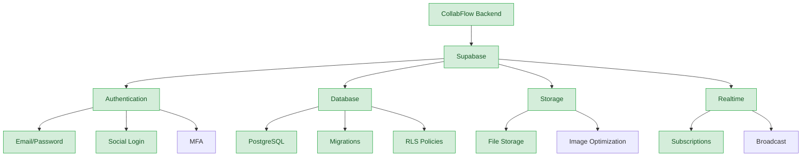

# Backend Architecture

*Last Updated: March 12, 2025*

This document provides a comprehensive overview of the CollabFlow backend architecture, database schema, and API integrations.

## Table of Contents
- [Supabase Integration](#supabase-integration)
- [Database Schema](#database-schema)
- [Authentication](#authentication)
- [API Implementation](#api-implementation)
- [Security Considerations](#security-considerations)

---

## Supabase Integration



### Key Features

- **Authentication**: Email/password and social login options with MFA support
- **Database**: PostgreSQL with proper schema design and migrations
- **Storage**: File storage for user uploads and attachments
- **Realtime**: Subscriptions for live updates to tasks and events

### Database Migration Guide

When applying migrations to your Supabase database:

1. **Local Development**:
   ```bash
   supabase migration new migration_name
   ```

2. **Edit the migration file** in `supabase/migrations/[timestamp]_migration_name.sql`

3. **Apply the migration locally**:
   ```bash
   supabase db reset
   ```

4. **Push to production**:
   ```bash
   supabase db push
   ```

5. **Verify the migration** in the Supabase dashboard

---

## Database Schema

### Calendar Events

```sql
create table calendar_events (
  id uuid default gen_random_uuid() primary key,
  title text not null,
  description text,
  date timestamptz not null,
  type text not null check (type in ('meeting', 'task', 'reminder')),
  created_at timestamptz default now(),
  user_id uuid references auth.users not null
);

-- RLS Policies
alter table calendar_events enable row level security;

create policy "Users can view their own events"
  on calendar_events for select
  using (auth.uid() = user_id);

create policy "Users can insert their own events"
  on calendar_events for insert
  with check (auth.uid() = user_id);
```

### Tasks

```sql
create table tasks (
  id uuid default gen_random_uuid() primary key,
  title text not null,
  description text,
  status text not null default 'todo' check (status in ('todo', 'in_progress', 'done')),
  priority text not null default 'medium' check (priority in ('low', 'medium', 'high')),
  due_date timestamptz,
  list_id uuid references task_lists(id),
  created_at timestamptz default now(),
  updated_at timestamptz default now(),
  user_id uuid references auth.users not null
);

-- RLS Policies
alter table tasks enable row level security;

create policy "Users can view their own tasks"
  on tasks for select
  using (auth.uid() = user_id);

create policy "Users can insert their own tasks"
  on tasks for insert
  with check (auth.uid() = user_id);
```

### Task Lists

```sql
create table task_lists (
  id uuid default gen_random_uuid() primary key,
  name text not null,
  color text not null default '#2f3c98',
  created_at timestamptz default now(),
  updated_at timestamptz default now(),
  user_id uuid references auth.users not null
);

-- RLS Policies
alter table task_lists enable row level security;

create policy "Users can view their own task lists"
  on task_lists for select
  using (auth.uid() = user_id);

create policy "Users can insert their own task lists"
  on task_lists for insert
  with check (auth.uid() = user_id);
```

### AI Messages

```sql
create table ai_messages (
  id uuid default gen_random_uuid() primary key,
  content text not null,
  is_user boolean not null,
  assistant_type text not null default 'personal',
  created_at timestamptz default now(),
  user_id uuid references auth.users not null
);

-- RLS Policies
alter table ai_messages enable row level security;

create policy "Users can view their own messages"
  on ai_messages for select
  using (auth.uid() = user_id);

create policy "Users can insert their own messages"
  on ai_messages for insert
  with check (auth.uid() = user_id);
```

### User Settings

```sql
create table user_settings (
  id uuid default gen_random_uuid() primary key,
  user_id uuid references auth.users not null unique,
  theme text default 'light' check (theme in ('light', 'dark', 'system')),
  notification_email boolean default true,
  notification_push boolean default true,
  notification_calendar_reminders boolean default true,
  notification_task_reminders boolean default true,
  date_format text default 'MM/DD/YYYY',
  time_format text default '12h',
  first_day_of_week integer default 0 check (first_day_of_week between 0 and 6),
  language text default 'en',
  created_at timestamptz default now(),
  updated_at timestamptz default now()
);

-- RLS Policies
alter table user_settings enable row level security;

create policy "Users can view their own settings"
  on user_settings for select
  using (auth.uid() = user_id);

create policy "Users can update their own settings"
  on user_settings for update
  using (auth.uid() = user_id);
```

---

## Authentication

### Multi-Factor Authentication (MFA)

```sql
-- MFA table for storing TOTP secrets
create table mfa_factors (
  id uuid default gen_random_uuid() primary key,
  user_id uuid references auth.users not null,
  friendly_name text,
  factor_type text not null check (factor_type in ('totp')),
  status text not null check (status in ('unverified', 'verified')),
  created_at timestamptz default now(),
  updated_at timestamptz default now(),
  secret text not null
);

-- RLS Policies
alter table mfa_factors enable row level security;

create policy "Users can view their own MFA factors"
  on mfa_factors for select
  using (auth.uid() = user_id);

create policy "Users can insert their own MFA factors"
  on mfa_factors for insert
  with check (auth.uid() = user_id);
```

### Role-Based Access Control

```sql
-- Add role to users
alter table auth.users add column if not exists role text not null default 'user' check (role in ('user', 'admin'));

-- Function to get user role
create or replace function get_user_role()
returns text as $$
begin
  return (
    select role from auth.users
    where id = auth.uid()
  );
end;
$$ language plpgsql security definer;

-- Example policy using roles
create policy "Admins can view all tasks"
  on tasks for select
  using (get_user_role() = 'admin');
```

---

## API Implementation

### Next.js API Routes

```typescript
// Example API route for tasks
// pages/api/tasks/index.ts
import { NextApiRequest, NextApiResponse } from 'next';
import { createServerSupabaseClient } from '@supabase/auth-helpers-nextjs';

export default async function handler(req: NextApiRequest, res: NextApiResponse) {
  const supabase = createServerSupabaseClient({ req, res });
  
  // Check if user is authenticated
  const { data: { session } } = await supabase.auth.getSession();
  if (!session) {
    return res.status(401).json({ error: 'Unauthorized' });
  }
  
  // Handle different HTTP methods
  switch (req.method) {
    case 'GET':
      const { data, error } = await supabase
        .from('tasks')
        .select('*')
        .order('due_date', { ascending: true });
        
      if (error) return res.status(500).json({ error: error.message });
      return res.status(200).json(data);
      
    case 'POST':
      const { title, description, status, priority, due_date, list_id } = req.body;
      
      const { data: newTask, error: insertError } = await supabase
        .from('tasks')
        .insert([
          { 
            title, 
            description, 
            status, 
            priority, 
            due_date, 
            list_id,
            user_id: session.user.id 
          }
        ])
        .select();
        
      if (insertError) return res.status(500).json({ error: insertError.message });
      return res.status(201).json(newTask[0]);
      
    default:
      return res.status(405).json({ error: 'Method not allowed' });
  }
}
```

### Direct Supabase Client Usage

```typescript
// Example of direct Supabase client usage in a React component
import { useSupabaseClient } from '@supabase/auth-helpers-react';

export function useCreateTask() {
  const supabase = useSupabaseClient();
  const queryClient = useQueryClient();
  
  return useMutation({
    mutationFn: async (newTask: Omit<Task, 'id' | 'created_at' | 'updated_at' | 'user_id'>) => {
      const { data, error } = await supabase
        .from('tasks')
        .insert([newTask])
        .select();
        
      if (error) throw error;
      return data[0];
    },
    onSuccess: () => {
      queryClient.invalidateQueries({ queryKey: ['tasks'] });
    },
  });
}
```

---

## Security Considerations

### Row Level Security (RLS) Policies

All tables implement proper RLS policies:

```sql
-- Example RLS policies for a table
alter table your_table enable row level security;

-- User can only see their own data
create policy "Users can view their own data"
  on your_table for select
  using (auth.uid() = user_id);

-- User can only insert their own data
create policy "Users can insert their own data"
  on your_table for insert
  with check (auth.uid() = user_id);

-- Admin can see all data
create policy "Admins can view all data"
  on your_table for select
  using (auth.jwt() ? 'app_role' && auth.jwt()->>'app_role' = 'admin');
```

### API Security

- **Authentication**: All API routes check for valid session
- **Input Validation**: Validate all input data before processing
- **Error Handling**: Proper error handling without exposing sensitive information
- **Rate Limiting**: Implement rate limiting for API routes
- **CORS**: Configure proper CORS settings

### Data Protection

- **Encryption**: Sensitive data is encrypted at rest
- **Backups**: Regular database backups
- **Audit Logs**: Track important actions for security auditing
- **Data Minimization**: Only collect necessary data
