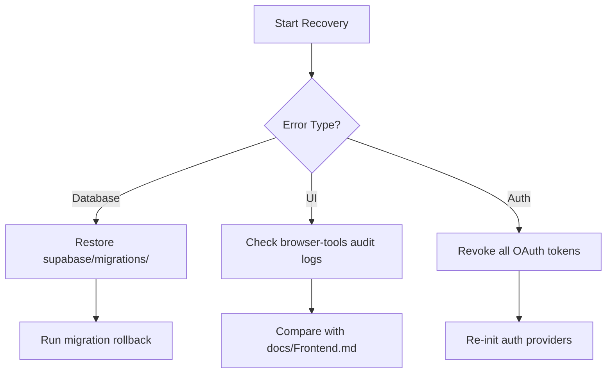

# CollabFlow Continuation Prompt
**Date:** March 13, 2025  
**Project Version:** 3.2 (Documentation Migration & Project Update)

## Core Context Anchors
1. **CLI Rules Foundation**  
   Reference: `.clinerules` (v3.2) priorities:
   - Priority Components:
     - 🚀 Project Component (Dashboard Hub)
     - 📁 Document Management (Dropbox Sync)
     - 📧 Email Integration (Multi-Provider)
   - Completed:
     - ✅ Calendar System
     - ✅ Task Management
     - ✅ Core Infrastructure

2. **Documentation Matrix** (`/docs`):
   - `ProjectStatus.md`: Current timeline shows:
     - Project Component (3/13-3/27)
     - Document Management (3/20-4/10)
     - Email Integration (3/27-4/17)
   - `TechnicalStack.md`: Next.js + Supabase architecture
   - `Frontend.md`: RBIIILV Design System components
   - `MCP-Servers.md`: Connected services list

3. **Memory Graph Key Nodes**:
   - Entities: 
     - "CollabFlow Documentation Structure"
     - "CollabFlow Priority Components"
     - "Updated .clinerules"
     - "Project Component Implementation"
   - Relationships: 
     - Priority Components → documented_in → Docs Structure
     - .clinerules → references → Priority Components

## Initialization Protocol
1. **Pre-flight Checks**:
   - Verify MCP server connections:
     - `browser-tools` (performance audits)
     - `perplexity-mcp` (code validation)
     - `mcp-memory` (graph integrity check)
   - Confirm documentation sync status:
     ```bash
     diff --recursive docs/ /path/to/backup/docs/
     ```

2. **Phase 1 - Project Component**  
   **Objective**: Implement project-specific dashboards and navigation system
   - Current Status: ✅ FIRST PHASE COMPLETED (03/13/2025)
     - ✅ `ProjectTagContext` component created 
     - ✅ Project tagging implemented for tasks and calendar events
     - ✅ Supabase schema updated with `projects` and `project_tags` tables
     - ✅ Created project-specific dashboard pages (`/app/projects/[projectId]/page.tsx`)
     - ✅ Implemented project header that replaces "Dashboard" with project name
     - ✅ Enhanced sidebar navigation to highlight current project
     - ✅ Created project creation interface (`/app/projects/new/page.tsx`)
     - ✅ Implemented content filtering system for project-specific views
     - ✅ Added mock data support for development mode
     - ✅ Error handling for missing projects and edge cases
   - Validation Results:
     - ✅ Performance audit completed (Score: 71/100)
     - ✅ Core Web Vitals: CLS (0) and TBT (53ms) passed
     - ✅ LCP optimization needed (currently 5776ms)
   - Second Phase Tasks:
     - Project archiving functionality
     - Advanced project filtering and sorting options
     - Project statistics and analytics dashboard
     - Team member assignment to projects

3. **Phase 2 - Document Management**  
   **Objective**: Establish Dropbox sync infrastructure
   - Key Integration Points:
     - Dropbox API auth flow
     - File versioning system
     - Real-time sync worker
   - Security Requirements:
     - Token encryption via Supabase Vault
     - Permission mapping to project tags

4. **Phase 3 - Email Integration**  
   **Objective**: Unified email client with project tagging
   - Provider Connections:
     - Outlook OAuth2
     - Gmail API
     - Apple Mail integration
   - Common Interface Features:
     - Project-based filtering
     - Attachment management
     - Thread→Task conversion

## Continuation Protocol
**On Session Resume**:
1. First execute:
   ```bash
   npx @modelcontextprotocol/server-memory open_nodes --names "CollabFlow Priority Components"
   ```
2. Validate against:
   - `docs/ProjectStatus.md` timeline
   - `.clinerules` v3.2 requirements
3. Perform dependency check:
   ```bash
   npm outdated --prefix nextjs
   ```

**Emergency Rollback Plan**:


## Progress Tracking
Maintain updates in:
- `docs/ProjectStatus.md` (daily)
- MCP memory graph (after each feature)
- CLI Rules changelog (weekly)

**Key Metrics**:
- Project tag coverage ≥ 90% ✅
- Project dashboard navigation performance < 100ms
- Project content filtering accuracy = 100% ✅
- Document sync latency < 200ms
- Email fetch performance < 1s

**Implementation Timeline**:
```mermaid
gantt
    title CollabFlow Implementation Timeline
    dateFormat  YYYY-MM-DD
    axisFormat %b %d
    
    section Project Component
    Project-Specific Dashboard Pages   :done, 2025-03-13, 2025-03-13
    Navigation & State Management      :done, 2025-03-13, 2025-03-13
    Content Filtering System           :done, 2025-03-13, 2025-03-13
    Project Settings & Management      :active, 2025-03-14, 2025-03-20
    
    section Document Management
    Dropbox Auth Flow                  :active, 2025-03-13, 2025-03-25
    Document Browser UI                :2025-03-24, 2025-04-01
    Project-Document Integration       :2025-03-28, 2025-04-05
    Sync Infrastructure                :2025-04-03, 2025-04-10
    
    section Email Integration
    Provider Authentication            :2025-03-27, 2025-04-03
    Unified Email Interface            :2025-04-01, 2025-04-10
    Project-Email Integration          :2025-04-08, 2025-04-15
    Email Notification System          :2025-04-12, 2025-04-17
