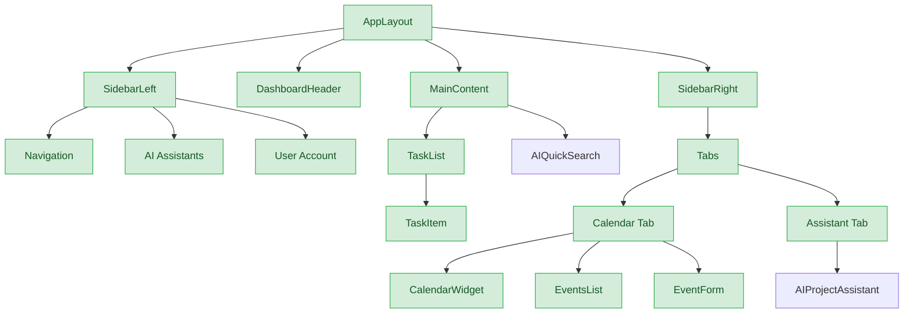
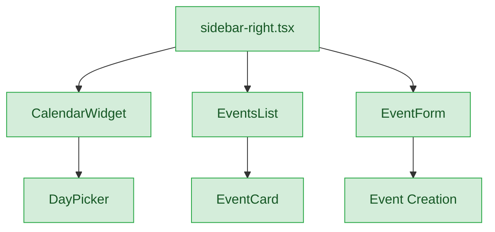
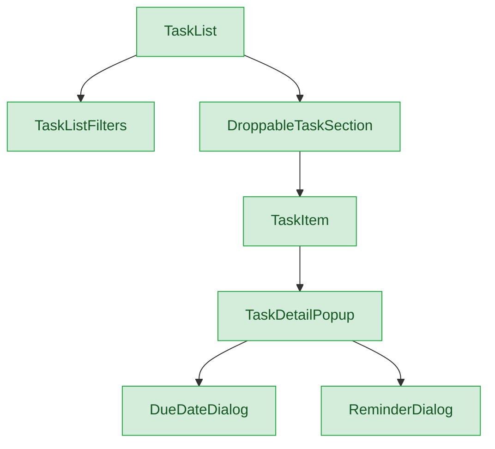
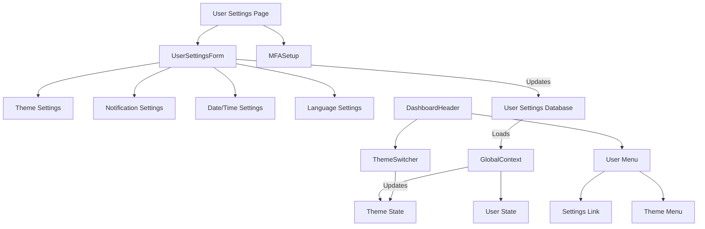

# Frontend Architecture

*Last Updated: March 12, 2025*

This document provides a comprehensive overview of the CollabFlow frontend architecture, component design, and development guidelines.

## Table of Contents
- [Component Architecture](#component-architecture)
- [Development Guidelines](#development-guidelines)
- [Feature Implementations](#feature-implementations)
- [State Management](#state-management)
- [Performance Optimization](#performance-optimization)

---

## Component Architecture



### Project Structure
- Follow Next.js recommended project structure
- Group related components in feature-specific directories
- Keep utility functions in dedicated lib directories
- Store hooks in a centralized hooks directory

### Component Design
- Create small, focused components (max 300 lines)
- Use composition over inheritance
- Follow single responsibility principle
- Document component props and usage

---

## Development Guidelines

### Code Organization

#### Component Structure
- Use functional components with hooks
- Separate business logic from UI rendering
- Extract reusable logic into custom hooks
- Keep component files focused on a single responsibility

#### Form Styling
- Follow the [Form Styling Guide](./FormStylingGuide.md) for consistent form input styling
- Use theme-aware color variables instead of hardcoded colors
- Ensure all form elements are visible in both light and dark modes
- Use the `.form-input` utility class for consistent styling

#### File Naming Conventions
- Use PascalCase for component files (e.g., `TaskList.tsx`)
- Use camelCase for utility files (e.g., `dateUtils.ts`)
- Use kebab-case for CSS modules (e.g., `task-list.module.css`)
- Group related files in feature-specific directories

### State Management
- Use React Context for global state
- Prefer local state when possible
- Avoid prop drilling with proper component structure
- Use React Query for server state management

### Git Practices
- Use feature branches for new development
- Write clear, descriptive commit messages
- Rebase instead of merge when updating branches
- Squash commits before merging to main

### Code Reviews
- Review all pull requests thoroughly
- Provide constructive feedback
- Verify functionality and code quality
- Ensure tests are included for new features

---

## Feature Implementations

### Calendar System (COMPLETE)

#### Component Architecture



#### Key Components

- **CalendarWidget**: Month calendar using react-day-picker with event indicators
- **EventsList**: Displays events for selected date with infinite scrolling
- **EventForm**: Form for creating/editing events
- **DraggableEventCard**: Makes event cards draggable for rescheduling
- **DroppableCalendarDay**: Makes calendar days accept dropped events

#### Enhanced Features

- **Outlook-Style Calendar Navigation**: Single header with Today button, month/year selector
- **Bidirectional Synchronization**: Calendar and events list stay in sync
- **Drag-and-Drop**: Easily reschedule events by dragging to a new date
- **Recurring Events**: Support for repeating events with exception handling

### Task Management (COMPLETE)

#### Component Architecture



#### Key Components

- **TaskList**: Main container for tasks with filtering and sorting
- **TaskListFilters**: UI for filtering tasks by status, priority, etc.
- **DroppableTaskSection**: Section for tasks grouped by timeframe (Today, Tomorrow, etc.)
- **TaskItem**: Individual task with title, description, and actions
- **TaskDetailPopup**: Detailed view and editing of task properties
- **DueDateDialog**: Dialog for setting task due dates
- **ReminderDialog**: Dialog for setting task reminders

#### Enhanced Features

- **Any.do-Style Task Management**: Collapsible sections for different timeframes
- **Drag-and-Drop**: Reorder tasks or move between sections
- **Priority Indicators**: Visual indicators for task priority levels
- **Status Management**: Track task progress (todo, in progress, done)
- **Task Filtering**: Filter tasks by various criteria

### User Settings Implementation

#### Component Architecture



#### Key Components

- **UserSettingsForm**: UI for updating user settings
- **ThemeSwitcher**: Toggle between light, dark, and system themes
- **MFASetup**: Two-factor authentication setup
- **NotificationSettings**: Configure notification preferences

---

## State Management

### React Context Implementation

```typescript
// Example of a context provider
export const TaskFiltersContext = createContext<TaskFiltersContextType | undefined>(undefined);

export function TaskFiltersProvider({ children }: { children: React.ReactNode }) {
  const [filters, setFilters] = useState<TaskFilters>({
    status: 'all',
    priority: 'all',
    search: '',
    listId: null,
  });

  const updateFilters = useCallback((newFilters: Partial<TaskFilters>) => {
    setFilters(prev => ({ ...prev, ...newFilters }));
  }, []);

  return (
    <TaskFiltersContext.Provider value={{ filters, updateFilters }}>
      {children}
    </TaskFiltersContext.Provider>
  );
}

// Custom hook for consuming the context
export function useTaskFilters() {
  const context = useContext(TaskFiltersContext);
  if (context === undefined) {
    throw new Error('useTaskFilters must be used within a TaskFiltersProvider');
  }
  return context;
}
```

### React Query for Server State

```typescript
// Example of a React Query hook
export function useTasks() {
  const supabase = useSupabaseClient();
  const { filters } = useTaskFilters();
  
  return useQuery({
    queryKey: ['tasks', filters],
    queryFn: async () => {
      let query = supabase
        .from('tasks')
        .select('*');
        
      if (filters.status !== 'all') {
        query = query.eq('status', filters.status);
      }
      
      if (filters.priority !== 'all') {
        query = query.eq('priority', filters.priority);
      }
      
      if (filters.search) {
        query = query.ilike('title', `%${filters.search}%`);
      }
      
      if (filters.listId) {
        query = query.eq('list_id', filters.listId);
      }
      
      const { data, error } = await query.order('due_date', { ascending: true });
        
      if (error) throw error;
      return data;
    },
  });
}
```

---

## Performance Optimization

### Code Splitting

```typescript
// Example of dynamic imports for code splitting
import dynamic from 'next/dynamic';

const TaskDetailPopup = dynamic(() => import('@/components/TaskDetailPopup'), {
  loading: () => <div className="p-4">Loading...</div>,
});
```

### Memoization

```typescript
// Example of memoization with useMemo and useCallback
const filteredTasks = useMemo(() => {
  return tasks.filter(task => {
    if (filters.status !== 'all' && task.status !== filters.status) return false;
    if (filters.priority !== 'all' && task.priority !== filters.priority) return false;
    if (filters.search && !task.title.toLowerCase().includes(filters.search.toLowerCase())) return false;
    if (filters.listId && task.list_id !== filters.listId) return false;
    return true;
  });
}, [tasks, filters]);

const handleTaskUpdate = useCallback((taskId: string, updates: Partial<Task>) => {
  // Update task logic
}, []);
```

### Preventing Infinite Loops

When working with React Context and hooks, it's important to properly memoize functions to prevent infinite loops:

```typescript
// Context provider with memoized functions
export function ProjectTagProvider({ children }: { children: ReactNode }) {
  // State declarations
  const [projectFilter, setProjectFilter] = useState<string | null>(null);
  const [selectedProjects, setSelectedProjects] = useState<Project[]>([]);
  
  // Memoize functions that are passed as dependencies to useEffect or event handlers
  const setProjectFilterWithLog = useCallback((projectId: string | null) => {
    console.log("Setting project filter to:", projectId);
    setProjectFilter(projectId);
  }, []);
  
  const resetProjectFilter = useCallback(() => {
    console.log("Resetting project filter");
    setProjectFilter(null);
  }, []);
  
  // Create the context value with memoized functions
  const contextValue = {
    projectFilter,
    setProjectFilter: setProjectFilterWithLog,
    selectedProjects,
    setSelectedProjects,
    resetProjectFilter
  };
  
  return (
    <ProjectTagContext.Provider value={contextValue}>
      {children}
    </ProjectTagContext.Provider>
  );
}

// Component using the context
function ProjectSelector({ taskId }: { taskId: string | null }) {
  const { selectedProjects, setSelectedProjects, getTaskProjects } = useProjectTags();
  
  // Memoize the function to load task projects
  const loadTaskProjects = useCallback(() => {
    if (taskId) {
      const taskProjects = getTaskProjects(taskId);
      setSelectedProjects(taskProjects);
    } else {
      setSelectedProjects([]);
    }
  }, [taskId, getTaskProjects, setSelectedProjects]);
  
  // Use the memoized function in useEffect
  useEffect(() => {
    loadTaskProjects();
  }, [loadTaskProjects]);
  
  // Rest of the component...
}
```

#### Common Pitfalls to Avoid

1. **Unmemoized Functions in Dependencies**: Always memoize functions that are used as dependencies in useEffect or event handlers.
2. **Missing Dependencies**: Ensure all dependencies are properly listed in the dependency array.
3. **Circular Dependencies**: Avoid circular dependencies between components and contexts.
4. **Unnecessary Re-renders**: Use React.memo for components that don't need to re-render when parent components re-render.
5. **Improper Dialog Handling**: When using Dialog components, ensure proper state management in onOpenChange callbacks.

```typescript
// Example of proper Dialog handling
<Dialog
  open={isOpen}
  onOpenChange={useCallback((open: boolean) => {
    setIsOpen(open);
    if (!open) clearSelectedItems();
  }, [clearSelectedItems, setIsOpen])}
>
  <DialogContent>
    <DialogHeader>
      <DialogTitle>Dialog Title</DialogTitle>
    </DialogHeader>
    {/* Dialog content */}
  </DialogContent>
</Dialog>
```

### Virtualization

```typescript
// Example of virtualization for long lists
import { useVirtualizer } from '@tanstack/react-virtual';

function VirtualizedTaskList({ tasks }) {
  const parentRef = useRef<HTMLDivElement>(null);
  
  const rowVirtualizer = useVirtualizer({
    count: tasks.length,
    getScrollElement: () => parentRef.current,
    estimateSize: () => 60,
    overscan: 5,
  });
  
  return (
    <div ref={parentRef} className="h-[500px] overflow-auto">
      <div
        style={{
          height: `${rowVirtualizer.getTotalSize()}px`,
          width: '100%',
          position: 'relative',
        }}
      >
        {rowVirtualizer.getVirtualItems().map(virtualRow => (
          <div
            key={virtualRow.index}
            style={{
              position: 'absolute',
              top: 0,
              left: 0,
              width: '100%',
              height: `${virtualRow.size}px`,
              transform: `translateY(${virtualRow.start}px)`,
            }}
          >
            <TaskItem task={tasks[virtualRow.index]} />
          </div>
        ))}
      </div>
    </div>
  );
}
```

### Image Optimization

```typescript
// Example of Next.js Image component for optimized images
import Image from 'next/image';

function UserAvatar({ user }) {
  return (
    <div className="relative h-10 w-10 rounded-full overflow-hidden">
      <Image
        src={user.avatarUrl || '/default-avatar.png'}
        alt={`${user.name}'s avatar`}
        fill
        sizes="40px"
        className="object-cover"
      />
    </div>
  );
}
