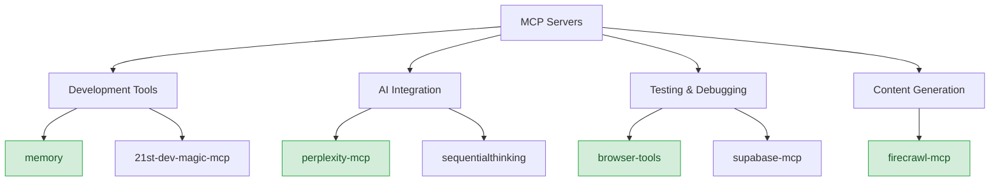

# MCP Servers

*Last Updated: March 14, 2025*

This document provides a comprehensive overview of the Model Context Protocol (MCP) servers used as tools to build the CollabFlow project. These servers are not integrated into the application itself but serve as development tools.

## Table of Contents
- [Overview](#overview)
- [Available MCP Servers](#available-mcp-servers)
- [Memory MCP](#memory-mcp)
- [Perplexity MCP](#perplexity-mcp)
- [Browser Tools](#browser-tools)
- [21st.dev Magic MCP](#21stdev-magic-mcp)
- [Firecrawl MCP](#firecrawl-mcp)
- [Best Practices](#best-practices)

---

## Overview



Model Context Protocol (MCP) servers provide powerful tools for development, testing, and content generation. These servers are used during the development process but are not integrated into the final application.

---

## Available MCP Servers

The CollabFlow project uses the following MCP servers as development tools:

1. **memory** - For persistent knowledge storage during development
2. **perplexity-mcp** - For AI-powered search and documentation
3. **supabase-mcp** - For database operations and testing
4. **sequentialthinking** - For structured problem-solving
5. **firecrawl-mcp** - For web scraping and content extraction
6. **browser-tools** - For browser debugging and testing
7. **21st-dev-magic-mcp** - For UI component generation and logo integration

---

## Memory MCP

The memory MCP server provides a persistent knowledge graph for storing information during development.

### Key Features

- **Knowledge Graph**: Store and retrieve information in a structured graph
- **Entity Management**: Create, update, and delete entities
- **Relationship Management**: Define relationships between entities
- **Search Capabilities**: Search for entities and relationships
- **Database Integration**: Persistent storage in Supabase database
- **API Integration**: Server-side API routes for client-side components

### Usage Examples

```typescript
// Store information in memory graph
await use_mcp_tool("mcp-memory", "create_entities", {
  entities: [
    {
      name: "CalendarComponent",
      entityType: "UIComponent",
      observations: [
        "Implemented with react-day-picker",
        "Supports event indicators",
        "Bidirectional synchronization with events list"
      ]
    }
  ]
});

// Create relationships between entities
await use_mcp_tool("mcp-memory", "create_relations", {
  relations: [
    {
      from: "CalendarComponent",
      to: "EventsList",
      relationType: "synchronizes with"
    }
  ]
});

// Retrieve information from memory graph
const result = await use_mcp_tool("mcp-memory", "search_nodes", {
  query: "CalendarComponent"
});

// Using the useMcpMemory hook (client-side)
import { useMcpMemory } from "@/hooks/useMcpMemory";

function MyComponent() {
  const { createEntities, createRelations, isLoading, error } = useMcpMemory();
  
  const handleDocumentUpload = async (document) => {
    // Create document entity in memory graph
    await createEntities([
      {
        name: `Document: ${document.name}`,
        entityType: "Document",
        observations: [
          `Uploaded on ${new Date().toLocaleString()}`,
          `Size: ${Math.round(document.size / 1024)} KB`,
          `Type: ${document.type}`
        ]
      }
    ]);
    
    // Create relationship to project if applicable
    if (document.projectId) {
      await createRelations([
        {
          from: `Document: ${document.name}`,
          to: `Project: ${document.projectName}`,
          relationType: "belongs_to"
        }
      ]);
    }
  };
  
  return (
    // Component JSX
  );
}
```

### Integration with Document Management

The memory MCP server is integrated with the document management system to track documents and their relationships to projects. This integration provides the following benefits:

1. **Document Tracking**: Track document uploads, downloads, and deletions
2. **Project Associations**: Track document associations with projects
3. **Version History**: Track document version history
4. **Audit Trail**: Maintain an audit trail of document operations

#### Implementation Details

1. **Database Schema**:
   - `mcp_entities` table for storing entities
   - `mcp_relations` table for storing relationships
   - Row-level security policies for data protection

2. **API Routes**:
   - `/api/mcp/memory` route for server-side operations
   - Supports create_entities, create_relations, add_observations, delete_entities

3. **Client-Side Hooks**:
   - `useMcpMemory` hook for client-side components
   - Provides createEntities, createRelations, addObservations, deleteEntities functions

4. **Document Upload Integration**:
   - Creates document entity on upload
   - Creates project-document relation if applicable
   - Adds observations about document metadata

5. **Document Deletion Integration**:
   - Updates document entity on deletion
   - Maintains relationship history

### Best Practices

1. **Store Knowledge**: Use the memory graph to store knowledge that needs to be persistent across development sessions.
2. **Retrieve Knowledge**: Before searching external sources, check if the information is already in the memory graph.
3. **Update Knowledge**: Keep the memory graph up-to-date by updating entities when new information is available.
4. **Organize Knowledge**: Use entity types and relations to organize knowledge in a structured way.
5. **Fallback Mechanism**: Implement fallback mechanisms for when the MCP server is not available.
6. **Error Handling**: Implement proper error handling for MCP operations.

---

## Perplexity MCP

The perplexity-mcp server provides AI-powered search and documentation capabilities during development.

### Key Features

- **AI Search**: Search for information using natural language
- **Documentation**: Get documentation for specific technologies
- **API Reference**: Access API references and examples
- **Code Snippets**: Find code snippets and examples

### Usage Examples

```typescript
// Search for information
const searchResults = await use_mcp_tool({
  server_name: 'perplexity-mcp',
  tool_name: 'search',
  arguments: {
    query: "Next.js App Router best practices",
    detail_level: "normal"
  }
});

// Get documentation for a specific technology
const docs = await use_mcp_tool({
  server_name: 'perplexity-mcp',
  tool_name: 'get_documentation',
  arguments: {
    query: "Supabase Row Level Security",
    context: "React application"
  }
});

// Check for deprecated code
const deprecationCheck = await use_mcp_tool({
  server_name: 'perplexity-mcp',
  tool_name: 'check_deprecated_code',
  arguments: {
    code: "componentWillMount() { ... }",
    technology: "React"
  }
});

// Find suitable APIs
const apiSuggestions = await use_mcp_tool({
  server_name: 'perplexity-mcp',
  tool_name: 'find_apis',
  arguments: {
    requirement: "Calendar integration",
    context: "React application with Next.js"
  }
});
```

---

## Browser Tools

The browser-tools MCP server provides debugging and testing capabilities for browser-based applications.

### Key Features

- **Console Logs**: View browser console logs
- **Network Logs**: Monitor network requests and responses
- **Screenshots**: Take screenshots of the current browser state
- **Accessibility Audit**: Run accessibility audits
- **Performance Audit**: Run performance audits

### Usage Examples

```typescript
// Check console logs
const consoleLogs = await use_mcp_tool({
  server_name: 'browser-tools',
  tool_name: 'getConsoleLogs',
  arguments: {}
});

// Check console errors
const consoleErrors = await use_mcp_tool({
  server_name: 'browser-tools',
  tool_name: 'getConsoleErrors',
  arguments: {}
});

// Take a screenshot
const screenshot = await use_mcp_tool({
  server_name: 'browser-tools',
  tool_name: 'takeScreenshot',
  arguments: {}
});

// Run accessibility audit
const accessibilityAudit = await use_mcp_tool({
  server_name: 'browser-tools',
  tool_name: 'runAccessibilityAudit',
  arguments: {}
});

// Run performance audit
const performanceAudit = await use_mcp_tool({
  server_name: 'browser-tools',
  tool_name: 'runPerformanceAudit',
  arguments: {}
});
```

---

## 21st.dev Magic MCP

The 21st-dev-magic-mcp server provides UI component generation and logo integration capabilities.

### Key Features

- **UI Component Generation**: Generate React UI components based on natural language descriptions
- **Logo Integration**: Find and integrate brand logos into the application
- **Tailwind CSS Integration**: Components use Tailwind CSS for styling
- **Radix UI Integration**: Components use Radix UI for accessibility

### Usage Examples

```typescript
// Generate a UI component
const componentResult = await use_mcp_tool({
  server_name: '21st-dev-magic-mcp',
  tool_name: '21st_magic_component_builder',
  arguments: {
    message: "Create a responsive pricing card component with a title, price, feature list, and a call-to-action button",
    searchQuery: "pricing card"
  }
});

// Search for company logos
const logoResult = await use_mcp_tool({
  server_name: '21st-dev-magic-mcp',
  tool_name: 'logo_search',
  arguments: {
    queries: ["github", "discord", "slack"],
    format: "TSX" // Options: "JSX", "TSX", "SVG"
  }
});
```

### Best Practices

1. **Component Organization**:
   - Store generated components in `src/components/ui/` directory
   - Keep logo components in `src/components/icons/` directory

2. **Customization**:
   - Customize generated components to match your project's design system
   - Adjust Tailwind classes to maintain consistency with existing components

---

## Firecrawl MCP

The firecrawl-mcp server provides web scraping and content extraction capabilities.

### Key Features

- **Web Scraping**: Scrape content from websites
- **Content Extraction**: Extract specific content from web pages
- **Web Search**: Search the web for information
- **URL Discovery**: Discover URLs from a starting point

### Usage Examples

```typescript
// Scrape a webpage
const scrapedContent = await use_mcp_tool({
  server_name: 'firecrawl-mcp-server',
  tool_name: 'firecrawl_scrape',
  arguments: {
    url: "https://example.com",
    formats: ["markdown"],
    onlyMainContent: true
  }
});

// Search the web
const searchResults = await use_mcp_tool({
  server_name: 'firecrawl-mcp-server',
  tool_name: 'firecrawl_search',
  arguments: {
    query: "Next.js App Router",
    limit: 5
  }
});

// Discover URLs
const urlMap = await use_mcp_tool({
  server_name: 'firecrawl-mcp-server',
  tool_name: 'firecrawl_map',
  arguments: {
    url: "https://example.com",
    limit: 100
  }
});

// Extract structured data
const extractedData = await use_mcp_tool({
  server_name: 'firecrawl-mcp-server',
  tool_name: 'firecrawl_extract',
  arguments: {
    urls: ["https://example.com"],
    prompt: "Extract product information including name, price, and description"
  }
});
```

---

## Best Practices

### Error Handling

Always implement proper error handling when using MCP tools:

```typescript
try {
  const result = await use_mcp_tool({
    server_name: 'perplexity-mcp',
    tool_name: 'search',
    arguments: {
      query: "search query"
    }
  });
  
  // Process result
} catch (error) {
  console.error("MCP tool error:", error);
  
  // Fallback behavior
}
```

### Development Mode

Implement development mode support for MCP tools:

```typescript
// Development mode detection
const isDevelopment = typeof window !== 'undefined' && window.location.hostname === 'localhost';

async function searchWithPerplexity(query) {
  // In development mode, use mock data
  if (isDevelopment) {
    console.log("Development mode: Using mock search results");
    return mockSearchResults;
  }
  
  // In production, use MCP tool
  try {
    const result = await use_mcp_tool({
      server_name: 'perplexity-mcp',
      tool_name: 'search',
      arguments: {
        query
      }
    });
    
    return result;
  } catch (error) {
    console.error("Search error:", error);
    
    // Fallback to mock data in development mode
    if (isDevelopment) {
      console.warn("Falling back to mock search results");
      return mockSearchResults;
    }
    
    throw error;
  }
}
```

### Integration with React Components

Integrate MCP tools with React components using custom hooks:

```typescript
// Custom hook for Perplexity search
function usePerplexitySearch() {
  const [results, setResults] = useState([]);
  const [isLoading, setIsLoading] = useState(false);
  const [error, setError] = useState(null);
  
  const search = useCallback(async (query) => {
    setIsLoading(true);
    setError(null);
    
    try {
      const result = await use_mcp_tool({
        server_name: 'perplexity-mcp',
        tool_name: 'search',
        arguments: {
          query
        }
      });
      
      setResults(result);
      return result;
    } catch (err) {
      setError(err.message);
      return [];
    } finally {
      setIsLoading(false);
    }
  }, []);
  
  return { search, results, isLoading, error };
}
```

### MCP Server Configuration

MCP servers are configured in the `cline_mcp_settings.json` file:

```json
{
  "mcpServers": {
    "memory": {
      "command": "npx",
      "args": ["-y", "@modelcontextprotocol/server-memory"],
      "disabled": false,
      "autoApprove": ["search_nodes", "read_graph"]
    },
    "perplexity-mcp": {
      "command": "node",
      "args": ["path/to/perplexity-mcp/build/index.js"],
      "env": {
        "PERPLEXITY_API_KEY": "your-api-key"
      },
      "disabled": false,
      "autoApprove": ["search", "get_documentation"]
    }
  }
}
```

Remember that MCP servers are development tools and not part of the final application. They are used to assist in building the application but are not integrated into the application itself.
