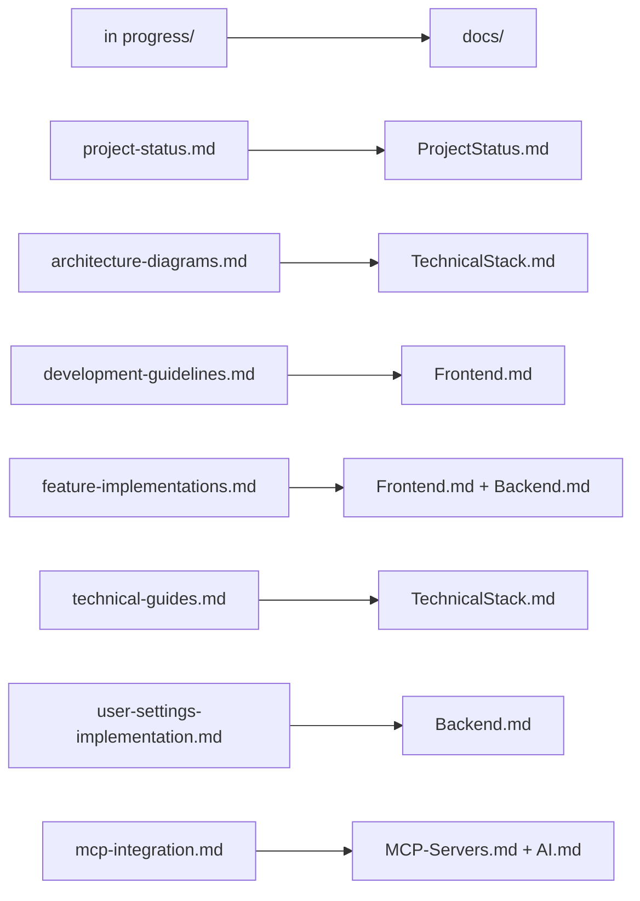

# Documentation Migration Checklist

*Last Updated: March 12, 2025*

This checklist confirms the successful migration of content from the "in progress" directory to the new "docs" directory structure.

## Table of Contents
- [Migration Overview](#migration-overview)
- [File Mapping](#file-mapping)
- [Content Verification](#content-verification)
- [MCP Memory Alignment](#mcp-memory-alignment)
- [Cleanup Tasks](#cleanup-tasks)

---

## Migration Overview

The migration has consolidated information from multiple "in progress" files into a more organized and cohesive documentation structure in the "docs" directory.

---

## File Mapping

| Source File | Destination File(s) | Status |
|-------------|---------------------|--------|
| project-status.md | ProjectStatus.md | ✅ Completed |
| architecture-diagrams.md | TechnicalStack.md | ✅ Completed |
| development-guidelines.md | Frontend.md | ✅ Completed |
| feature-implementations.md | Frontend.md, Backend.md | ✅ Completed |
| technical-guides.md | TechnicalStack.md | ✅ Completed |
| user-settings-implementation.md | Backend.md | ✅ Completed |
| mcp-integration.md | MCP-Servers.md, AI.md | ✅ Completed |

---

## Content Verification

### Key Content Migrated

- ✅ Project status and roadmap
- ✅ Completed features (Calendar and Task Management marked as COMPLETE)
- ✅ Architecture diagrams and component relationships
- ✅ Technical stack details and implementation guidelines
- ✅ Frontend component architecture and development guidelines
- ✅ Backend database schema and API implementation
- ✅ AI integration components and implementation details
- ✅ MCP server tools and usage guidelines

### Enhanced Content

- ✅ Added more comprehensive Mermaid diagrams
- ✅ Improved organization with clear section headers
- ✅ Updated content to reflect current project state
- ✅ Added last updated timestamps
- ✅ Standardized formatting across all documentation files

---

## MCP Memory Alignment

The following MCP memory entities have been verified to align with the new documentation structure:

- ✅ Project Documentation
- ✅ MCP Server Integrations
- ✅ MCP Integration Guidelines
- ✅ CollabFlow Project Status
- ✅ CollabFlow Development Guidelines
- ✅ CollabFlow MCP Integration Guide
- ✅ CollabFlow Coding Guidelines

---

## Cleanup Tasks

- [x] Delete "in progress" directory after final verification
- [ ] Update any references to "in progress" files in code or documentation
- [ ] Notify team members of the new documentation structure
- [ ] Set up a documentation review schedule to keep content up-to-date

---

## Final Verification

Before deleting the "in progress" directory, perform a final verification:

1. Confirm all content has been migrated correctly
2. Verify that no unique information has been lost
3. Check that all Mermaid diagrams render correctly
4. Ensure code examples are properly formatted
5. Validate links and references within the documentation
