# CollabFlow Project Status

*Last Updated: March 14, 2025*

This document provides a comprehensive overview of the current project status, including completed features, ongoing work, and future plans.

## Table of Contents
- [Project Overview](#project-overview)
- [Completed Features](#completed-features)
- [Current Priority Tasks](#current-priority-tasks)
- [Future Enhancements](#future-enhancements)
- [Implementation Timeline](#implementation-timeline)

---

## Project Overview

```mermaid
flowchart TD
    A[CollabFlow] --> B[Core Infrastructure]
    A --> C[UI Components]
    A --> D[Data Management]
    A --> E[Integrations]
    
    B --> B1[Next.js App Router]
    B --> B2[Supabase Integration]
    B --> B3[Role-based Access Control]
    
    C --> C1[Dashboard Layout]
    C --> C2[Calendar System - COMPLETE]
    C --> C3[Task Management - COMPLETE]
    C --> C4[Project Component - PRIORITY]
    C --> C5[AI Components]
    
    D --> D1[React Query Hooks]
    D --> D2[Supabase Schema]
    D --> D3[Document Management - PRIORITY]
    
    E --> E1[Email Integration - PRIORITY]
    E --> E2[Dropbox Integration - PRIORITY]
    E --> E3[Third-Party Calendar]
    
    classDef complete fill:#d4edda,stroke:#28a745,color:#155724
    classDef priority fill:#cce5ff,stroke:#0d6efd,color:#004085
    
    class C2,C3 complete
    class C4,D3,E1,E2 priority
```



CollabFlow is a comprehensive collaboration and project management tool built with Next.js and Supabase. The core infrastructure and UI components are complete, with recent milestones including the right sidebar, calendar widget, and events list implementation.

### Core Infrastructure
- Next.js App Router with server-side rendering
- Supabase integration with proper authentication
- Role-based access control (RBAC) with admin and user roles
- Development mode support for testing without authentication

### UI Components
- Dashboard layout with left and right sidebars
- Calendar widget with event management
- Task management with priority indicators
- AI components (AIQuickSearch, AIProjectAssistant)
- RBIIILV Design System implementation
- Theme switching with light, dark, and system modes

---

## Completed Features

### Calendar System (COMPLETE)
- Calendar widget with month view
- Events list with infinite scrolling
- Bidirectional synchronization between calendar and events
- Drag-and-drop event rescheduling
- Event creation and editing forms
- Month view with react-day-picker
- Event indicators as colored dots
- Outlook-style navigation
- Recurring events with exception handling
- Accessibility improvements:
  - Added proper dialog titles for screen reader compatibility
  - Enhanced keyboard navigation for calendar components

### Task Management (COMPLETE)
- Task creation with title, description, and due date
- Priority indicators (low, medium, high)
- Status management (todo, in progress, done)
- Filtering and sorting capabilities
- Drag-and-drop task organization
- Task detail popup with editing capabilities
- Task list filters and search functionality

### AI Integration (In Progress)
- AI Quick Search with Perplexity API
- AI Project Assistant in right sidebar
- AI Messages database schema

---

## Current Priority Tasks

1. **Project Component** (First Phase Completed - 03/13/2025)
   - Dashboard as summary hub for all projects combined ✅
   - Project-specific pages with filtered views ✅
   - Project tagging for tasks, events, documents, etc. ✅
     - Project database schema with Supabase migrations ✅
     - Project tag context and hooks for state management ✅
     - Project selector in task detail popup ✅
     - Project filtering in task list ✅
     - Project color indicators in calendar widget ✅
     - Replaced list tags with project tags for unified organization ✅
   - Project-specific dashboards with similar layout to main dashboard ✅
   - Enhanced sidebar navigation with project list ✅
   - Project creation and management interface ✅
   - Mock data support for development mode ✅
   - Performance audit completed (Score: 71/100) ✅
   - Bug fixes:
     - Fixed infinite loop error in TaskList component ✅
     - Added proper memoization to context provider functions ✅
     - Updated dependency arrays in useEffect hooks ✅
     - Added error handling for missing projects ✅
   - Remaining work to be done in second phase:
     - Project archiving functionality
     - Advanced project filtering and sorting options
     - Project statistics and analytics dashboard
     - Team member assignment to projects
   - Estimated timeline for second phase: 1 week (Expected completion: March 20, 2025)

2. **Document Management with Dropbox Integration** (In Progress - Started March 13, 2025)
   - Authentication Framework Completed ✅
     - OAuth 2.0 flow with Dropbox API ✅
     - Token management (access, refresh) ✅
     - Secure token storage in Supabase ✅
     - Development mode support with mock data ✅
   - Document Database Schema Created ✅
     - Documents table with metadata ✅
     - Document versions tracking ✅
     - Document-project associations ✅
     - Sync logs for tracking operations ✅
   - UI Implementation Started ✅
     - Connection UI for Dropbox authentication ✅
     - Document browsing interface ✅
     - Project-specific document views ✅
   - File Operations Implemented ✅
     - Document upload functionality ✅
     - Document download functionality ✅
     - File versioning system ✅
     - Version history viewer ✅
     - Document deletion with Dropbox sync ✅
     - MCP memory integration for document tracking ✅
   - MCP Memory Integration Completed ✅
     - Document entity tracking in memory graph ✅
     - Project-document relations in memory graph ✅
     - API routes for MCP memory operations ✅
     - Client-side hooks for memory operations ✅
     - Database schema for persistent memory storage ✅
   - Remaining Implementation Items:
     - Real-time sync worker
     - Permission mapping to project tags
     - Document preview functionality
     - Batch operations for multiple files
   - Estimated timeline: 2 weeks (Expected completion: March 28, 2025)

3. **Email Integration**
   - Integration with Outlook, Apple Mail, Gmail, etc.
   - Mirror of user's email integrations
   - Email organization and filtering
   - Project-specific email views
   - Estimated timeline: 3 weeks

4. **Notification System**
   - Real-time notifications for events and tasks
   - Email notifications for important updates
   - Notification preferences in user settings
   - Estimated timeline: 2 weeks

---

## Future Enhancements

1. **AI Integration**
   - AI assistants as project experts
   - Context-aware AI recommendations
   - Document analysis capabilities
   - Task-specific AI suggestions
   - Estimated timeline: After core components completion

2. **Third-Party Calendar Syncing**
   - Integration with Google Calendar
   - Integration with iCloud Calendar
   - Integration with Outlook Calendar
   - Two-way synchronization
   - Estimated timeline: After core components completion

3. **Advanced User Profile Features**
   - User profile pictures and avatars
   - User activity history and statistics
   - User achievements and gamification

4. **Team Collaboration Features**
   - Shared calendars and task lists
   - Team chat and messaging
   - Permission management

---

## Implementation Timeline

```mermaid
gantt
    title CollabFlow Project Implementation Timeline
    dateFormat  YYYY-MM-DD
    axisFormat %b %d
    
    section Completed Features
    Calendar System                      :done, 2025-02-15, 2025-03-01
    Task Management                      :done, 2025-02-20, 2025-03-05
    
    section Current Development
    Project Component                    :active, 2025-03-13, 2025-03-27
    Project Tagging System               :done, 2025-03-13, 2025-03-14
    Document Management                  :2025-03-20, 2025-04-10
    Email Integration                    :2025-03-27, 2025-04-17
    Notification System                  :2025-04-10, 2025-04-24
    
    section Future Development
    AI Integration                       :2025-04-24, 2025-05-15
    Third-Party Calendar Syncing         :2025-05-01, 2025-05-22
    Advanced User Profile                :2025-05-15, 2025-05-29
    Team Collaboration                   :2025-05-22, 2025-06-12
    
    section Milestones
    Core Components Complete             :milestone, 2025-04-24, 0d
    Beta Release                         :milestone, 2025-05-15, 0d
    Final Release                        :milestone, 2025-06-15, 0d
