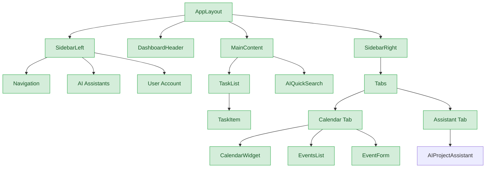
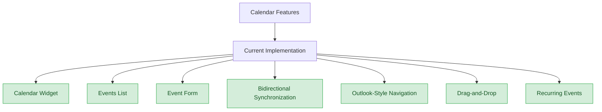

# Technical Stack

*Last Updated: March 12, 2025*

This document provides a comprehensive overview of the CollabFlow technical stack, architecture, and implementation details.

## Table of Contents
- [Architecture Overview](#architecture-overview)
- [Core Infrastructure](#core-infrastructure)
- [UI Components](#ui-components)
- [Design System](#design-system)
- [Data Management](#data-management)
- [Performance Considerations](#performance-considerations)

---

## Architecture Overview

```mermaid
graph TD
    %% Core Project Structure
    A[CollabFlow Project] --> B[Core Infrastructure]
    A --> C[UI Components]
    A --> D[Data Management]
    A --> E[MCP Server Integrations]
    
    %% Core Infrastructure Details
    B --> B1[Next.js App Router]
    B --> B2[Supabase Integration]
    B --> B3[Role-based Access Control]
    B --> B4[Development Mode Support]
    
    %% UI Components Details
    C --> C1[Dashboard Layout]
    C --> C2[Calendar Widget]
    C --> C3[Task Management]
    C --> C4[AI Components]
    C --> C5[RBIIILV Design System]
    
    %% Data Management Details
    D --> D1[React Query Hooks]
    D --> D2[Supabase Schema]
    D --> D3[Mock Data]
    
    %% MCP Server Integrations Details
    E --> E1[perplexity-mcp]
    E --> E2[supabase-mcp]
    E --> E3[memory]
    
    %% Style Definitions
    classDef completed fill:#d4edda,stroke:#28a745,color:#155724
    
    %% Apply Styles
    class B1,B2,B3,B4,C1,C2,C3,C5,D1,D2,D3,E1,E2,E3 completed
```



The CollabFlow architecture follows a modern, component-based approach with clear separation of concerns. The application is built on Next.js with the App Router, using Supabase for backend services and database management.

---

## Core Infrastructure

### Next.js Implementation

- **App Router**: Leveraging the latest Next.js routing system for improved performance and SEO
- **Server Components**: Using React Server Components where appropriate to reduce client-side JavaScript
- **Client Components**: Interactive elements built as client components with proper hydration
- **API Routes**: Backend functionality exposed through Next.js API routes

### Supabase Integration

- **Authentication**: Email/password and social login options
- **Database**: PostgreSQL with proper schema design and migrations
- **Storage**: File storage for user uploads and attachments
- **Realtime**: Subscriptions for live updates to tasks and events

### Database Migration Guide

When applying migrations to your Supabase database:

1. **Local Development**:
   ```bash
   supabase migration new migration_name
   ```

2. **Edit the migration file** in `supabase/migrations/[timestamp]_migration_name.sql`

3. **Apply the migration locally**:
   ```bash
   supabase db reset
   ```

4. **Push to production**:
   ```bash
   supabase db push
   ```

5. **Verify the migration** in the Supabase dashboard

### Row Level Security (RLS) Policies

All tables implement proper RLS policies:

```sql
-- Example RLS policies for a table
alter table your_table enable row level security;

-- User can only see their own data
create policy "Users can view their own data"
  on your_table for select
  using (auth.uid() = user_id);

-- User can only insert their own data
create policy "Users can insert their own data"
  on your_table for insert
  with check (auth.uid() = user_id);

-- Admin can see all data
create policy "Admins can view all data"
  on your_table for select
  using (auth.jwt() ? 'app_role' && auth.jwt()->>'app_role' = 'admin');
```

---

## UI Components

### Component Relationships



### Calendar Feature Implementation



### Component Development Guidelines

For better accessibility, ensure all form fields have proper `id` and `name` attributes that match their labels:

```typescript
// Before
<input
    type="text"
    value={title}
    onChange={(e) => setTitle(e.target.value)}
    className="w-full rounded-md border px-3 py-2"
    required
/>

// After
<input
    type="text"
    id="event-title"
    name="event-title"
    value={title}
    onChange={(e) => setTitle(e.target.value)}
    className="w-full rounded-md border px-3 py-2"
    required
/>
```

When working with nullable fields, ensure proper type handling:

```typescript
// Error: Type 'string | null' is not assignable to type 'string | undefined'
const eventData = {
  title,
  description: description || null,
  location: location || null, // Error here
}

// Fix by using undefined instead of null
const eventData = {
  title,
  description: description || null, // This can stay null if the API expects it
  location: location || undefined, // Changed to undefined
}
```

---

## Design System

### RBIIILV Design System

#### Core Principles
1. **Professional Minimalism**: Clean lines, purposeful whitespace
2. **Functional Hierarchy**: Clear visual weight distribution
3. **Consistent Interaction Patterns**: Predictable component behaviors
4. **Accessibility First**: AA compliance minimum

#### Color Schema
- Primary: `#0a0a0a` (Rich Black)
- Secondary: `#2f3c98` (Dynamic Blue)
- Background: `#ffffff` (Pure White)
- Surface: `#b6b8c1` (Grey)
- Error: `#dc2626` (Crimson)
- Success: `#16a34a` (Emerald)

#### Typography
- Primary Font: Inter (System Stack)
- Code Font: JetBrains Mono
- Base Size: 16px
- Scale: 1.125 Major Third

#### Layout Components

##### Sidebar System
```tsx
interface SidebarConfig {
  collapsedWidth: number;
  expandedWidth: number;
  breakpoint: 'md' | 'lg';
  persistentGroups: string[];
  collapsibleGroups: string[];
}
```

##### Task List
The task list uses a fixed height and displays tasks grouped by timeframe (Today, Tomorrow, etc.):

```tsx
// TaskList.tsx
<div
    ref={containerRef}
    className="h-[500px] overflow-y-auto" /* Fixed height instead of max-height */
    onScroll={handleScroll}
>
```

The task items now display the associated project or list instead of the due date:

```tsx
// TaskItem.tsx
<div className="flex items-center mt-2 text-xs text-foreground">
    <Tag className="h-3 w-3 mr-1" />
    <span className={cn(
        "font-medium",
        task.completed && "line-through"
    )}>
        {task.list_id && taskLists.find(list => list.id === task.list_id)
            ? taskLists.find(list => list.id === task.list_id)?.name
            : "Personal"}
    </span>
</div>
```

#### Animation & Transitions

##### Standard Durations
- Fast: 0.15s (150ms) - For small UI elements like buttons, toggles
- Medium: 0.3s (300ms) - For expanding/collapsing sections, modals
- Slow: 0.5s (500ms) - For page transitions, complex animations

##### Easing Functions
- Default: `ease` - General purpose
- Emphasis: `cubic-bezier(0.175, 0.885, 0.32, 1.275)` - For attention-grabbing animations
- Smooth: `cubic-bezier(0.4, 0.0, 0.2, 1)` - For natural-feeling transitions

---

## Data Management

### React Query Implementation

The application uses React Query for data fetching and state management:

```typescript
// Example of a React Query hook
export function useTasks() {
  const supabase = useSupabaseClient();
  
  return useQuery({
    queryKey: ['tasks'],
    queryFn: async () => {
      const { data, error } = await supabase
        .from('tasks')
        .select('*')
        .order('due_date', { ascending: true });
        
      if (error) throw error;
      return data;
    },
  });
}
```

### State Management

- **React Context**: Used for global state management
- **Local State**: Component-specific state using React's useState
- **Server State**: Managed through React Query
- **Form State**: Handled with React Hook Form

---

## Performance Considerations

### Optimization Techniques

- **Code Splitting**: Dynamic imports for route-based code splitting
- **Image Optimization**: Next.js Image component for optimized image loading
- **Lazy Loading**: Components loaded only when needed
- **Memoization**: React.memo and useMemo for expensive computations
- **Virtualization**: For long lists of tasks and events

### Monitoring and Metrics

- **Lighthouse Scores**: Regular audits for performance, accessibility, and SEO
- **Core Web Vitals**: Monitoring LCP, FID, and CLS
- **Error Tracking**: Integration with error monitoring services
- **Analytics**: User behavior tracking for performance optimization
