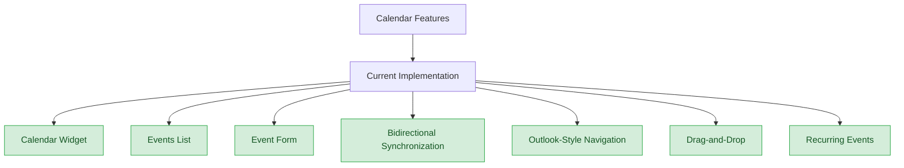
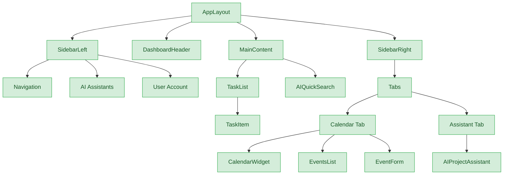

# Architecture Diagrams

{/* Updated to reflect current project state (sidebar, calendar, events list completed) - 3/4/2025 */}

This document contains key architectural diagrams for the CollabFlow project.

## Project Structure

```mermaid
graph TD
    %% Core Project Structure
    A[CollabFlow Project] --> B[Core Infrastructure]
    A --> C[UI Components]
    A --> D[Data Management]
    A --> E[MCP Server Integrations]
    
    %% Core Infrastructure Details
    B --> B1[Next.js App Router]
    B --> B2[Supabase Integration]
    B --> B3[Role-based Access Control]
    B --> B4[Development Mode Support]
    
    %% UI Components Details
    C --> C1[Dashboard Layout]
    C --> C2[Calendar Widget]
    C --> C3[Task Management]
    C --> C4[AI Components]
    C --> C5[RBIIILV Design System]
    
    %% Data Management Details
    D --> D1[React Query Hooks]
    D --> D2[Supabase Schema]
    D --> D3[Mock Data]
    
    %% MCP Server Integrations Details
    E --> E1[perplexity-mcp]
    E --> E2[supabase-mcp]
    E --> E3[memory]
    
    %% Style Definitions
    classDef completed fill:#d4edda,stroke:#28a745,color:#155724
    classDef inprogress fill:#cce5ff,stroke:#0d6efd,color:#004085
    
    %% Apply Styles
    class B1,B2,B3,B4,C1,C2,C3,C4,C5,D1,D2,D3,E1,E2,E3 completed
```



## Calendar Feature Implementation



## Component Relationships



## Implementation Timeline

```mermaid
gantt
    title CollabFlow Project Implementation Timeline
    dateFormat  YYYY-MM-DD
    axisFormat %b %d
    
    section Completed Features
    Drag-and-Drop for Calendar Events    :done, 2025-02-27, 7d
    Recurring Events                     :done, 2025-02-15, 14d
    
    section Current Development
    User Profile and Settings            :active, 2025-03-06, 10d
    Theme Switching with Dark Mode        :2025-03-16, 7d
    
    section Future Development
    Notification System                 :2025-03-23, 10d
    Third-Party Calendar Syncing        :2025-04-02, 21d
    
    section Milestones
    Beta Release                         :milestone, 2025-05-01, 0d
    Final Release                        :milestone, 2025-06-15, 0d
