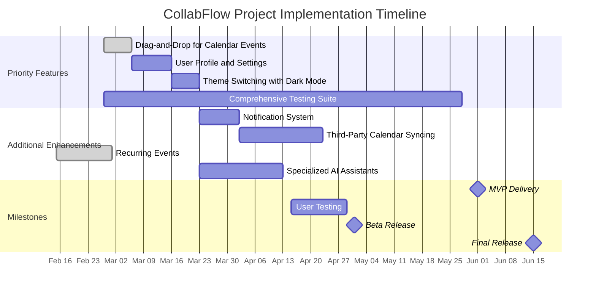

# Architecture Diagrams

This document contains key architectural diagrams for the CollabFlow project.

## Project Structure

```mermaid
graph TD
    %% Core Project Structure
    A[CollabFlow Project] --> B[Core Infrastructure]
    A --> C[UI Components]
    A --> D[Data Management]
    A --> E[MCP Server Integrations]
    
    %% Core Infrastructure Details
    B --> B1[Next.js App Router]
    B --> B2[Supabase Integration]
    B --> B3[Role-based Access Control]
    B --> B4[Development Mode Support]
    
    %% UI Components Details
    C --> C1[Dashboard Layout]
    C --> C2[Calendar Widget]
    C --> C3[Task Management]
    C --> C4[AI Components]
    C --> C5[RBIIILV Design System]
    
    %% Data Management Details
    D --> D1[React Query Hooks]
    D --> D2[Supabase Schema]
    D --> D3[Mock Data]
    
    %% MCP Server Integrations Details
    E --> E1[perplexity-mcp]
    E --> E2[supabase-mcp]
    E --> E3[memory]
    
    %% Priority Next Steps
    A --> F[Priority Next Steps]
    F --> F1[Drag-and-Drop for Calendar Events ✅]
    F --> F3[User Profile and Settings]
    F --> F4[Theme Switching with Dark Mode]
    F --> F5[Comprehensive Testing Suite]
    
    %% Additional Enhancements
    A --> G[Additional Enhancements]
    G --> G1[Notification System]
    G --> G2[Third-Party Calendar Syncing]
    G --> G3[Recurring Events ✅]
    G --> G4[Specialized AI Assistants]
    
    %% Style Definitions
    classDef completed fill:#d4edda,stroke:#28a745,color:#155724
    classDef priority fill:#cce5ff,stroke:#0d6efd,color:#004085
    classDef enhancement fill:#fff3cd,stroke:#ffc107,color:#856404
    
    %% Apply Styles
    class B1,B2,B3,B4,C1,C2,C3,C4,C5,D1,D2,D3,E1,E2,E3 completed
    class F3,F4,F5 priority
    class F1,G3 completed
    class G1,G2,G4 enhancement
```



## Calendar Feature Implementation

```mermaid
graph TD
    %% Calendar Feature Implementation
    A[Calendar Features] --> B[Current Implementation]
    A --> C[Priority Next Steps]
    
    %% Current Implementation
    B --> B1[Calendar Widget]
    B --> B2[Events List]
    B --> B3[Event Form]
    B --> B4[Bidirectional Synchronization]
    B --> B5[Outlook-Style Navigation]
    B --> B6[Drag-and-Drop ✅]
    B --> B7[Recurring Events ✅]
    
    %% Priority Next Steps
    C --> C4[Third-Party Syncing]
    C --> C5[Notification System]
    
    %% Drag-and-Drop Details
    B6 --> D1[DraggableEventCard]
    B6 --> D2[DroppableCalendarDay]
    B6 --> D3[useUpdateEventDate Hook]
    
    %% Recurring Events Details
    B7 --> F1[Recurrence Rules Schema]
    B7 --> F2[Recurrence Editor UI]
    B7 --> F3[Expansion Logic]
    B7 --> F4[Exception Handling]
    
    %% Third-Party Syncing Details
    C4 --> G1[Google Calendar]
    C4 --> G2[iCloud]
    C4 --> G3[Outlook]
    C4 --> G4[Sync Logic]
    
    %% Style Definitions
    classDef completed fill:#d4edda,stroke:#28a745,color:#155724
    classDef priority fill:#cce5ff,stroke:#0d6efd,color:#004085
    classDef future fill:#fff3cd,stroke:#ffc107,color:#856404
    
    %% Apply Styles
    class B1,B2,B3,B4,B5,B6,B7,D1,D2,D3,F1,F2,F3,F4 completed
    class C4,C5,G1,G2,G3,G4 future
```



## AI Components Implementation

```mermaid
graph TD
    %% AI Components Implementation
    A[AI Components] --> B[Current Implementation]
    A --> C[Future Enhancements]
    
    %% Current Implementation
    B --> B1[AIQuickSearch]
    B --> B2[AIProjectAssistant]
    B --> B3[AI Messages Schema]
    B --> B4[Perplexity Integration]
    
    %% Future Enhancements
    C --> C1[Research Assistant]
    C --> C2[Legal Assistant]
    C --> C3[Finance Assistant]
    C --> C4[Enhanced Context]
    
    %% AIQuickSearch Details
    B1 --> D1[Search Interface]
    B1 --> D2[Perplexity API]
    B1 --> D3[Results Display]
    
    %% AIProjectAssistant Details
    B2 --> E1[Chat Interface]
    B2 --> E2[Message History]
    B2 --> E3[Data Access]
    
    %% Specialized Assistants Common Features
    C1 --> F1[Domain-Specific Prompts]
    C2 --> F1
    C3 --> F1
    C1 --> F2[Specialized UI]
    C2 --> F2
    C3 --> F2
    C1 --> F3[Relevant Data Sources]
    C2 --> F3
    C3 --> F3
    
    %% MCP Server Integration
    A --> G[MCP Server Integration]
    G --> G1[perplexity-mcp]
    G --> G2[sequentialthinking]
    G --> G3[firecrawl-mcp]
    
    %% Style Definitions
    classDef completed fill:#d4edda,stroke:#28a745,color:#155724
    classDef inprogress fill:#cce5ff,stroke:#0d6efd,color:#004085
    classDef future fill:#fff3cd,stroke:#ffc107,color:#856404
    
    %% Apply Styles
    class B1,B2,B3,B4,D1,D2,D3,E1,E2,E3,G1 completed
    class C4,G2 inprogress
    class C1,C2,C3,F1,F2,F3,G3 future
```



## Implementation Timeline



## Component Relationships

```mermaid
flowchart TD
    %% Main Components
    A[AppLayout] --> B[SidebarLeft]
    A --> C[DashboardHeader]
    A --> D[MainContent]
    A --> E[SidebarRight]
    
    %% Left Sidebar Components
    B --> B1[Navigation]
    B --> B2[AI Assistants]
    B --> B3[User Account]
    
    %% Main Content Components
    D --> D1[TaskList]
    D --> D2[AIQuickSearch]
    D1 --> D1a[TaskItem]
    
    %% Right Sidebar Components
    E --> E1[Tabs]
    E1 --> E1a[Calendar Tab]
    E1 --> E1b[Assistant Tab]
    E1a --> E1a1[CalendarWidget]
    E1a --> E1a2[EventsList]
    E1a --> E1a3[EventForm]
    E1b --> E1b1[AIProjectAssistant]
    
    %% New Components to Implement
    D --> D3[UserProfilePage]
    D3 --> D3a[UserSettingsForm]
    D3 --> D3b[NotificationPreferences]
    D3 --> D3c[AccountManagement]
    
    %% Style Definitions
    classDef existing fill:#d4edda,stroke:#28a745,color:#155724
    classDef new fill:#cce5ff,stroke:#0d6efd,color:#004085
    
    %% Apply Styles
    class A,B,C,D,E,B1,B2,B3,D1,D2,D1a,E1,E1a,E1b,E1a1,E1a2,E1a3,E1b1 existing
    class D3,D3a,D3b,D3c new
