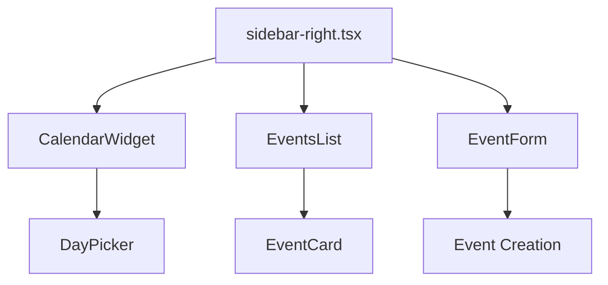

# Calendar Integration Documentation

## Component Architecture

### 1. Component Structure


### 2. Component Implementations

#### calendar-widget.tsx
```typescript
interface CalendarWidgetProps {
  selectedDate: Date
  onDateSelect: (date: Date) => void
  events: CalendarEvent[]
}

export function CalendarWidget({ selectedDate, onDateSelect, events }: CalendarWidgetProps) {
  // Custom day content renderer
  function renderDay(day: Date) {
    const dayEvents = events.filter(event => 
      isSameDay(parseISO(event.date), day)
    )

    const uniqueTypes = [...new Set(dayEvents.map(event => event.type))]
    const isSelected = isSameDay(day, selectedDate)

    return (
      <div className={cn(
        "relative flex h-full w-full flex-col items-center justify-center",
        isSelected && "rounded-full bg-primary text-primary-foreground"
      )}>
        <div className="text-center">{format(day, "d")}</div>
        {dayEvents.length > 0 && (
          <div className="absolute bottom-1 flex gap-0.5">
            {uniqueTypes.map((type, i) => (
              <div
                key={type}
                className={`h-1.5 w-1.5 rounded-full ${typeColors[type]}`}
                style={{
                  transform: `translateX(${i * 6 - (uniqueTypes.length - 1) * 3}px)`
                }}
              />
            ))}
          </div>
        )}
      </div>
    )
  }

  return (
    <div className="rounded-lg border">
      <DayPicker
        mode="single"
        selected={selectedDate}
        onSelect={(date) => date && onDateSelect(date)}
        showOutsideDays={true}
        fixedWeeks
        captionLayout="buttons"
        components={{
          DayContent: ({ date, ...props }) => date && renderDay(date)
        }}
      />
    </div>
  )
}
```

#### events-list.tsx
```typescript
interface EventsListProps {
  date: Date
  events: CalendarEvent[]
}

export function EventsList({ date, events }: EventsListProps) {
  const dayEvents = events
    .filter(event => isSameDay(parseISO(event.date), date))
    .sort((a, b) => parseISO(a.date).getTime() - parseISO(b.date).getTime())

  return (
    <div className="space-y-4">
      <div className="flex items-center justify-between">
        <h3 className="text-2xl font-bold">
          {format(date, "d")} {format(date, "EEEE")}
        </h3>
        <span className="text-sm text-muted-foreground">{dayEvents.length} events</span>
      </div>
      {dayEvents.length === 0 ? (
        <div className="rounded-lg border border-dashed p-8 text-center">
          <p className="text-muted-foreground">No events scheduled for today</p>
        </div>
      ) : (
        <div className="space-y-3">
          {dayEvents.map(event => (
            <EventCard key={event.id} event={event} />
          ))}
        </div>
      )}
    </div>
  )
}
```

#### EventForm.tsx
```typescript
interface EventFormProps {
  selectedDate: Date
  onEventAdded: (event: EventData) => void
}

export function EventForm({ selectedDate, onEventAdded }: EventFormProps) {
  const [isOpen, setIsOpen] = useState(false)
  const [title, setTitle] = useState("")
  const [description, setDescription] = useState("")
  const [type, setType] = useState<"meeting" | "task" | "reminder">("meeting")
  const [time, setTime] = useState("12:00")

  const handleSubmit = async (e: React.FormEvent) => {
    e.preventDefault()

    try {
      // Create date with selected time
      const [hours, minutes] = time.split(":").map(Number)
      const eventDate = new Date(selectedDate)
      eventDate.setHours(hours, minutes, 0, 0)

      // Create a mock event for the UI
      const mockEvent: EventData = {
        id: crypto.randomUUID(),
        title,
        description: description || null,
        date: eventDate.toISOString(),
        type,
        user_id: "b9b36d04-59e0-49d7-83ff-46c5186a8cf4",
        created_at: new Date().toISOString()
      }

      // Reset form and close
      setTitle("")
      setDescription("")
      setType("meeting")
      setTime("12:00")
      setIsOpen(false)

      // Notify parent component with the new event
      onEventAdded(mockEvent)
    } catch (error) {
      console.error("Error in event creation:", error)
      alert("An error occurred. Please try again.")
    }
  }

  return (
    <div className="rounded-lg border p-4 shadow-md">
      <h3 className="mb-4 text-lg font-medium">Add Event for {format(selectedDate, "MMMM d, yyyy")}</h3>
      <form onSubmit={handleSubmit} className="space-y-4">
        {/* Form fields for title, description, type, time */}
        <div className="flex justify-end space-x-2 pt-2">
          <Button type="button" onClick={() => setIsOpen(false)} variant="outline">Cancel</Button>
          <Button type="submit">Save</Button>
        </div>
      </form>
    </div>
  )
}
```

## State Management

### 1. Types and Interfaces
```typescript
interface CalendarEvent {
  id: string
  title: string
  date: string
  description?: string
  type: 'meeting' | 'task' | 'reminder'
}

interface CalendarState {
  selectedDate: Date
  events: CalendarEvent[]
  isLoading: boolean
  error: string | null
}
```

### 2. State Management with React Query
```typescript
// hooks/useCalendarEvents.ts
export function useCalendarEvents(date: Date) {
  return useQuery({
    queryKey: ['events', format(date, 'yyyy-MM')],
    queryFn: () => fetchEventsForMonth(date),
    staleTime: 5 * 60 * 1000, // Consider data fresh for 5 minutes
  })
}

// hooks/useCreateEvent.ts
export function useCreateEvent() {
  const queryClient = useQueryClient()
  
  return useMutation({
    mutationFn: createEvent,
    onSuccess: () => {
      queryClient.invalidateQueries({ queryKey: ['events'] })
    },
  })
}
```

## Styling and Animations

### 1. Calendar Styling
```css
/* Base calendar styles */
.calendar-container {
  @apply rounded-lg border bg-card p-4;
}

/* Day styles */
.calendar-day {
  @apply relative p-3 text-sm transition-colors hover:bg-accent hover:text-accent-foreground;
}

/* Event indicator */
.event-indicator {
  @apply absolute bottom-1 left-1/2 h-1 w-1 -translate-x-1/2 rounded-full bg-primary;
}

/* Selected day */
.selected-day {
  @apply bg-primary text-primary-foreground hover:bg-primary hover:text-primary-foreground;
}
```

### 2. Animations
```typescript
// Framer Motion animations for event list
const listVariants = {
  hidden: { opacity: 0, y: 20 },
  visible: {
    opacity: 1,
    y: 0,
    transition: {
      staggerChildren: 0.1
    }
  }
}

const itemVariants = {
  hidden: { opacity: 0, x: -20 },
  visible: { opacity: 1, x: 0 }
}
```

## Integration with Supabase

### 1. Database Schema
```sql
create table calendar_events (
  id uuid default gen_random_uuid() primary key,
  title text not null,
  description text,
  date timestamptz not null,
  type text not null check (type in ('meeting', 'task', 'reminder')),
  created_at timestamptz default now(),
  user_id uuid references auth.users not null
);

-- RLS Policies
alter table calendar_events enable row level security;

create policy "Users can view their own events"
  on calendar_events for select
  using (auth.uid() = user_id);

create policy "Users can insert their own events"
  on calendar_events for insert
  with check (auth.uid() = user_id);
```

### 2. Event Fetching
```typescript
async function fetchEventsForMonth(date: Date): Promise<CalendarEvent[]> {
  const startOfMonth = startOfMonth(date)
  const endOfMonth = endOfMonth(date)
  
  const { data, error } = await supabase
    .from('calendar_events')
    .select('*')
    .gte('date', startOfMonth.toISOString())
    .lte('date', endOfMonth.toISOString())
    .order('date', { ascending: true })
  
  if (error) throw error
  return data
}
```

## Current Implementation

```typescript
// sidebar-right.tsx
export function SidebarRight() {
  const [selectedDate, setSelectedDate] = useState<Date>(new Date());
  const [sidebarWidth, setSidebarWidth] = useState(320);
  const [isResizing, setIsResizing] = useState(false);
  const [localEvents, setLocalEvents] = useState<CalendarEvent[]>(testEvents);
  const [showCalendar, setShowCalendar] = useState(true);
  const resizeHandleRef = useRef<HTMLDivElement>(null);
  
  // We use local events instead of API data due to authentication issues
  const { isLoading } = useCalendarEvents(selectedDate);
  const events = localEvents;

  const handleEventAdded = (event: EventData) => {
    console.log("New event added:", event);

    // Add the new event to local events
    setLocalEvents(prev => {
      const newEvents = [...prev, event];
      return newEvents;
    });

    // Force a re-render by setting the selected date
    setSelectedDate(new Date(event.date));
  };

  // Resize handler implementation
  useEffect(() => {
    // Mouse event handlers for resizing
    // ...
  }, [isResizing]);

  return (
    <>
      {/* Resize handle */}
      <div
        ref={resizeHandleRef}
        className="absolute top-0 bottom-0 w-1 bg-transparent hover:bg-gray-300 cursor-col-resize z-10"
        style={{ left: `calc(100% - ${sidebarWidth}px - 2px)` }}
      />
      <Sidebar side="right" style={{ width: `${sidebarWidth}px` }}>
        <div className="flex h-full flex-col">
          <div className="flex-none">
            <div 
              className="flex items-center justify-center border-b p-4 cursor-pointer"
              onClick={() => setShowCalendar(!showCalendar)}
            >
              <div className="flex items-center gap-2">
                <span className="text-xl font-bold uppercase">
                  {format(selectedDate, "MMM yyyy")}
                </span>
                {showCalendar ? (
                  <ChevronUp className="h-5 w-5" />
                ) : (
                  <ChevronDown className="h-5 w-5" />
                )}
              </div>
            </div>
            {showCalendar && (
              <CalendarWidget
                selectedDate={selectedDate}
                onDateSelect={setSelectedDate}
                events={events}
              />
            )}
          </div>
          <div className="flex-1 overflow-auto border-t">
            {isLoading ? (
              <div className="flex items-center justify-center py-4">
                <div className="h-6 w-6 animate-spin rounded-full border-2 border-primary border-t-transparent" />
              </div>
            ) : (
              <div className="p-4 space-y-4">
                <EventForm
                  selectedDate={selectedDate}
                  onEventAdded={handleEventAdded}
                />
                <EventsList
                  date={selectedDate}
                  events={events}
                />
              </div>
            )}
          </div>
        </div>
      </Sidebar>
    </>
  );
}
```

## Enhanced Features

### 1. Streamlined Outlook-Style Calendar Navigation

The calendar now features a streamlined Outlook-style navigation system with a single header containing the "Today" button, month/year selector with navigation arrows, and calendar toggle button.

```typescript
// sidebar-right.tsx (key parts)
<div className="flex-none border-b">
  <div className="flex items-center justify-between p-2 relative">
    {/* Today button */}
    <Button
      variant="ghost"
      size="sm"
      onClick={() => setSelectedDate(new Date())}
      className="flex items-center gap-1"
    >
      <Calendar className="h-4 w-4" />
      <span>Today</span>
    </Button>
    
    {/* Month/Year selector with navigation in the middle */}
    <div className="flex items-center">
      <Button
        variant="ghost"
        size="sm"
        onClick={() => {
          const prevMonth = new Date(selectedDate);
          prevMonth.setMonth(prevMonth.getMonth() - 1);
          setSelectedDate(prevMonth);
        }}
      >
        <ChevronLeft className="h-4 w-4" />
      </Button>

      <div className="relative">
        <Button
          variant="ghost"
          className="mx-2 font-bold"
          onClick={() => setShowYearView(!showYearView)}
        >
          {format(selectedDate, "MMMM yyyy")}
        </Button>
        
        {/* Year view popup positioned directly under the button */}
        {showYearView && (
          <div className="absolute top-full left-1/2 transform -translate-x-1/2 mt-1 bg-background border rounded-md shadow-md z-10 p-2 w-64">
            {/* Year navigation and month grid */}
          </div>
        )}
      </div>

      <Button
        variant="ghost"
        size="sm"
        onClick={() => {
          const nextMonth = new Date(selectedDate);
          nextMonth.setMonth(nextMonth.getMonth() + 1);
          setSelectedDate(nextMonth);
        }}
      >
        <ChevronRight className="h-4 w-4" />
      </Button>
    </div>
    
    {/* Calendar toggle button on right */}
    <Button
      variant="ghost"
      size="sm"
      onClick={() => setShowCalendar(!showCalendar)}
      className="ml-auto"
    >
      {showCalendar ? <ChevronUp className="h-4 w-4" /> : <ChevronDown className="h-4 w-4" />}
    </Button>
  </div>

  {showCalendar && (
    <div>
      <CalendarWidget
        selectedDate={selectedDate}
        onDateSelect={(date) => {
          setSelectedDate(date);
          setShowYearView(false);
        }}
        events={events}
      />
    </div>
  )}
</div>
```

The CalendarWidget component has been updated to use the `month` property to ensure the calendar displays the correct month:

```typescript
// calendar-widget.tsx (key parts)
<DayPicker
  mode="single"
  month={selectedDate}  // This ensures the calendar shows the correct month
  selected={selectedDate}
  onSelect={(date) => date && onDateSelect(date)}
  showOutsideDays={true}
  fixedWeeks
  hideHead={false}
  className="w-full p-0"
  classNames={{
    // Hide the built-in navigation and caption
    caption: "hidden",
    caption_label: "hidden",
    nav: "hidden",
    nav_button: "hidden",
    nav_button_previous: "hidden",
    nav_button_next: "hidden",
    // Other class names...
  }}
  components={{
    DayContent: ({ date, ...props }) => date && renderDay(date)
  }}
/>
```

### 2. Improved Scrolling with Single Scrollbar

The events list is now the only scrollable area, with the main dashboard remaining fixed. This provides a cleaner interface with a single scrollbar.

```typescript
// sidebar-right.tsx
<Sidebar side="right" className="transition-none overflow-hidden" style={{ width: `${sidebarWidth}px` }}>
  <div className="flex h-full flex-col overflow-hidden">
    {/* Calendar header and widget (non-scrollable) */}
    <div className="flex-1 flex flex-col overflow-hidden">
      {/* Event form and list container */}
      <div className="p-4 space-y-4 flex-1 flex flex-col overflow-hidden">
        <EventForm
          selectedDate={selectedDate}
          onEventAdded={handleEventAdded}
        />
        <div className="flex-1 overflow-hidden">
          <EventsList
            date={selectedDate}
            events={events}
          />
        </div>
      </div>
    </div>
  </div>
</Sidebar>
```

```typescript
// events-list.tsx
<div className="h-full flex flex-col">
  <div
    ref={scrollContainerRef}
    className="space-y-4 overflow-y-auto flex-1 pr-2 h-full"
    style={{ scrollbarWidth: 'thin' }}
  >
    {/* Events by date */}
  </div>
</div>
```

### 3. Event Editing and Management

Events are now clickable and open a dialog for viewing details, with options to edit, delete, or close the event.

```typescript
function EventDialog({
  event,
  isOpen,
  onClose,
  onDelete
}: {
  event: CalendarEvent | null
  isOpen: boolean
  onClose: () => void
  onDelete: (id: string) => void
}) {
  const [isEditing, setIsEditing] = useState(false);
  const [title, setTitle] = useState("");
  const [description, setDescription] = useState("");
  const [type, setType] = useState<"meeting" | "task" | "reminder">("meeting");
  const [time, setTime] = useState("12:00");
  
  // Initialize form when event changes
  useEffect(() => {
    if (event) {
      const eventDate = parseISO(event.date);
      setTitle(event.title);
      setDescription(event.description || "");
      setType(event.type);
      setTime(format(eventDate, "HH:mm"));
    }
  }, [event]);
  
  // Render edit form or event details based on isEditing state
  return (
    <Dialog open={isOpen} onOpenChange={onClose}>
      <DialogContent className="sm:max-w-[425px]">
        <DialogHeader>
          <DialogTitle className="flex items-center gap-2">
            <div className={`h-3 w-3 rounded-full ${colors.dot}`} />
            {isEditing ? "Edit Event" : event.title}
          </DialogTitle>
        </DialogHeader>
        
        {isEditing ? (
          <div className="space-y-4 py-4">
            {/* Edit form fields */}
          </div>
        ) : (
          <div className="space-y-4 py-4">
            {/* Event details display */}
          </div>
        )}
        
        <DialogFooter className="flex justify-between">
          {isEditing ? (
            <>
              <Button
                variant="outline"
                onClick={() => setIsEditing(false)}
              >
                Cancel
              </Button>
              <Button onClick={handleSave}>Save</Button>
            </>
          ) : (
            <>
              <Button
                variant="destructive"
                onClick={() => {
                  onDelete(event.id);
                  onClose();
                }}
              >
                Delete
              </Button>
              <div className="space-x-2">
                <Button 
                  variant="outline"
                  onClick={() => setIsEditing(true)}
                >
                  Edit
                </Button>
                <Button onClick={onClose}>Close</Button>
              </div>
            </>
          )}
        </DialogFooter>
      </DialogContent>
    </Dialog>
  );
}
```

## Next Steps

1. ✅ Implement event creation form
2. ✅ Add resizable sidebar
3. ✅ Implement event indicators in calendar
4. ✅ Create event list view
5. ✅ Make events list infinitely scrollable by day
6. ✅ Implement event click functionality for viewing details
7. ✅ Fix the calendar toggle dropdown
8. ✅ Fix scrollbar issues and improve layout
9. ✅ Add event editing functionality
10. ✅ Implement Outlook-style calendar navigation with Today button
11. ✅ Add year view popup for quick month selection
12. ✅ Connect edit and delete functionality to the database API
13. ✅ Fix authentication issues for proper database integration
14. Add drag-and-drop support for event rescheduling
15. Add calendar view options (month, week, day)
16. Integrate with notification system for event reminders
17. Add third-party calendar syncing (Google Calendar, iCloud, Outlook)
18. Implement recurring events functionality

## Recent Updates

### Authentication Fix

The authentication system has been improved to properly integrate with the database:

1. **Auth Utilities**: Created a new `auth.ts` utility file with:
   - `useAuth` hook to get the current authenticated user
   - `getCurrentUserId` function to get the current user ID or a fallback ID
   - Shared Supabase client instance

2. **User ID Integration**: Updated components to use the current user's ID:
   - EventForm now gets the current user ID when creating events
   - EventDialog now includes the user ID when updating events
   - useCalendarEvents hook filters events by the current user ID

3. **Authentication UI**: Added authentication status indicators:
   - Color-coded status bar at the top of the sidebar
   - Logout button for authenticated users
   - Login prompt when authentication is required

4. **Fallback Mechanism**: Maintained the fallback to local events when authentication fails, but with improved error messages and guidance.

### Database Integration

The calendar components have been updated to connect with the Supabase database API:

1. **Event Creation**: The EventForm component now uses the useCreateEvent hook to create events in the database.
2. **Event Editing**: The EventDialog component now uses the useUpdateEvent hook to update events in the database.
3. **Event Deletion**: The EventsList component now uses the useDeleteEvent hook to delete events from the database.
4. **Fallback Mechanism**: The SidebarRight component now handles API errors gracefully by falling back to local events when the database connection fails due to authentication issues.

### Loading States

Loading indicators have been added to improve the user experience:

1. **Create Event**: The Save button in the EventForm shows a loading spinner when creating an event.
2. **Delete Event**: A modal loading indicator appears when deleting an event.
3. **Update Event**: The EventDialog handles loading states during event updates.
4. **Authentication**: A pulsing indicator shows when authentication is being checked.

### Error Handling

Error handling has been improved throughout the application:

1. **API Errors**: Error messages are displayed when API calls fail.
2. **Authentication Issues**: A fallback mechanism uses local events when authentication fails.
3. **Validation**: Form validation ensures data integrity before submission.
4. **Try-Catch Blocks**: Added comprehensive try-catch blocks for better error handling.

### Next Focus Areas

1. **Drag-and-Drop**: Implement drag-and-drop functionality for event rescheduling.
2. **Calendar Views**: Add month, week, and day view options.
3. **Notification System**: Integrate with a notification system for event reminders.
