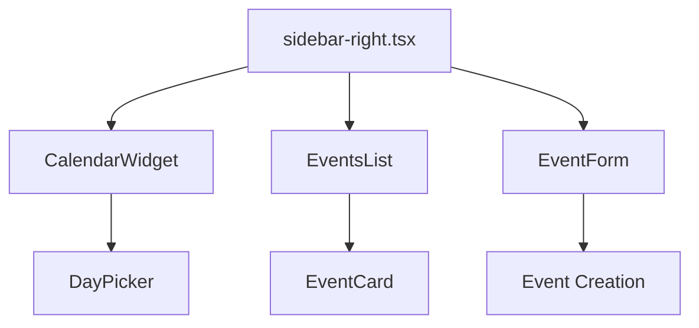
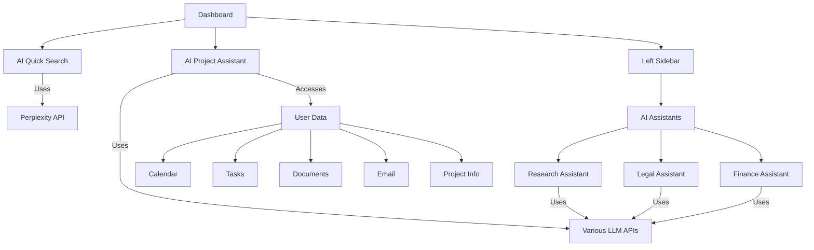
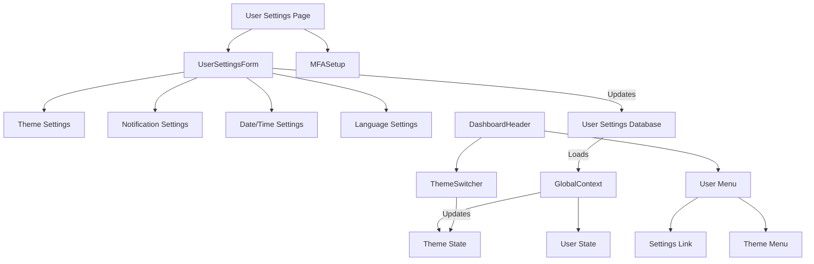

# Feature Implementations

{/* Updated to reflect current project state (sidebar, calendar, events list completed) - 3/4/2025 */}

This document provides an overview of key feature implementations in the CollabFlow project.

## Table of Contents
- [Calendar Integration](#calendar-integration)
- [Drag-and-Drop Calendar Events](#drag-and-drop-calendar-events)
- [AI Integration](#ai-integration)
- [User Profile and Settings](#user-profile-and-settings)

---

## Calendar Integration

### Component Architecture



### Key Components

#### CalendarWidget
- Renders a month calendar using react-day-picker
- Shows event indicators as colored dots under each day
- Supports date selection and navigation
- Custom day rendering for event indicators

#### EventsList
- Displays events for the selected date
- Groups events by date in chronological order
- Supports infinite scrolling
- Implements bidirectional synchronization with calendar

#### EventForm
- Provides form for creating new events
- Includes fields for title, description, type, and time
- Integrates with Supabase for data persistence

### Enhanced Features

#### Outlook-Style Calendar Navigation
- Single header with Today button, month/year selector, and navigation arrows
- Year view popup for quick month selection
- Calendar toggle button for showing/hiding the calendar

#### Any.do-Style Task Management
- Implemented Any.do-style task management with collapsible sections (Today, Tomorrow, etc.)
- Replaced the clock icon and "Today"/"Tomorrow" labels with project/list-specific tags
- Removed the "View" button and repositioned the "Add Task" button in the task list header

#### Improved Scrolling
- Single scrollbar for the events list
- Fixed header and calendar for better user experience
- Thin scrollbar styling for a cleaner interface

#### Event Management
- Dialog for viewing event details
- Edit mode for updating event information
- Delete functionality with confirmation
- Visual feedback for loading states

### Database Integration

```sql
create table calendar_events (
  id uuid default gen_random_uuid() primary key,
  title text not null,
  description text,
  date timestamptz not null,
  type text not null check (type in ('meeting', 'task', 'reminder')),
  created_at timestamptz default now(),
  user_id uuid references auth.users not null
);

-- RLS Policies
alter table calendar_events enable row level security;

create policy "Users can view their own events"
  on calendar_events for select
  using (auth.uid() = user_id);

create policy "Users can insert their own events"
  on calendar_events for insert
  with check (auth.uid() = user_id);
```

---

## Drag-and-Drop Calendar Events

### Implementation Overview

The drag-and-drop functionality for calendar events has been successfully implemented using React DnD, allowing users to easily reschedule events by dragging them to a new date.

### Key Components

#### DraggableEventCard
- Makes event cards draggable with visual feedback
- Only allows dragging of events owned by the current user
- Stores event data in the drag event for use by drop targets

#### DroppableCalendarDay
- Makes calendar days accept dropped events
- Provides visual feedback when dragging over a day
- Calls the parent handler to update the event date when dropped

#### useUpdateEventDate Hook
- Handles the actual date update logic
- Maintains the original time when changing the date
- Implements optimistic updates for a smoother user experience
- Provides error handling and success notifications

### Visual Feedback
- Dragged items show reduced opacity
- Drop targets highlight when an item is dragged over them
- Success/error toast notifications appear after drop operations

---

## AI Integration

### AI Components Architecture



### Database Schema

```sql
create table ai_messages (
  id uuid default gen_random_uuid() primary key,
  content text not null,
  is_user boolean not null,
  assistant_type text not null default 'personal',
  created_at timestamptz default now(),
  user_id uuid references auth.users not null
);

-- RLS Policies
alter table ai_messages enable row level security;

create policy "Users can view their own messages"
  on ai_messages for select
  using (auth.uid() = user_id);

create policy "Users can insert their own messages"
  on ai_messages for insert
  with check (auth.uid() = user_id);
```

---

## User Profile and Settings

### Component Architecture



### Database Schema

```sql
create table user_settings (
  id uuid default gen_random_uuid() primary key,
  user_id uuid references auth.users not null unique,
  theme text default 'light' check (theme in ('light', 'dark', 'system')),
  notification_email boolean default true,
  notification_push boolean default true,
  notification_calendar_reminders boolean default true,
  notification_task_reminders boolean default true,
  date_format text default 'MM/DD/YYYY',
  time_format text default '12h',
  first_day_of_week integer default 0 check (first_day_of_week between 0 and 6),
  language text default 'en',
  created_at timestamptz default now(),
  updated_at timestamptz default now()
);
```

### Key Components

#### UserSettingsForm
- Provides UI for updating user settings
- Includes theme selection, notification preferences, date/time formats, and language
- Uses React Query hooks for data fetching and mutations

#### ThemeSwitcher
- Allows switching between light, dark, and system themes
- Integrated in dashboard header and user settings

#### Theme System
- Uses CSS variables for theme-specific values
- Applied to document root element using data-theme attribute
