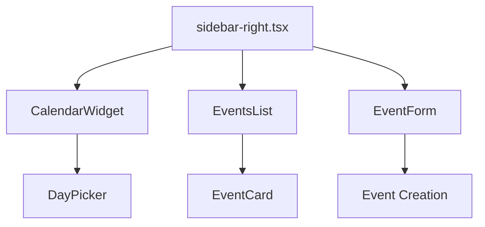
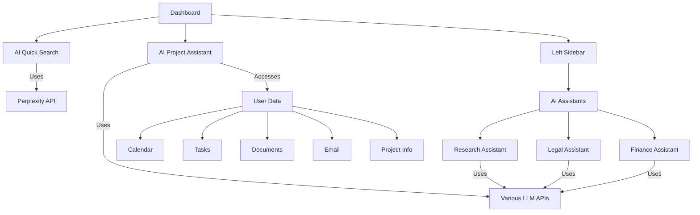

# Feature Implementations

This document provides an overview of key feature implementations in the CollabFlow project.

## Table of Contents
- [Calendar Integration](#calendar-integration)
- [Drag-and-Drop Calendar Events](#drag-and-drop-calendar-events)
- [AI Integration](#ai-integration)

---

## Calendar Integration

### Component Architecture



### Key Components

#### CalendarWidget
- Renders a month calendar using react-day-picker
- Shows event indicators as colored dots under each day
- Supports date selection and navigation
- Custom day rendering for event indicators

#### EventsList
- Displays events for the selected date
- Groups events by date in chronological order
- Supports infinite scrolling
- Implements bidirectional synchronization with calendar

#### EventForm
- Provides form for creating new events
- Includes fields for title, description, type, and time
- Supports development mode with mock data
- Integrates with Supabase for data persistence

### Enhanced Features

#### Outlook-Style Calendar Navigation
- Single header with Today button, month/year selector, and navigation arrows
- Year view popup for quick month selection
- Calendar toggle button for showing/hiding the calendar

#### Improved Scrolling
- Single scrollbar for the events list
- Fixed header and calendar for better user experience
- Thin scrollbar styling for a cleaner interface

#### Event Editing and Management
- Dialog for viewing event details
- Edit mode for updating event information
- Delete functionality with confirmation
- Visual feedback for loading states

### Database Integration

#### Schema
```sql
create table calendar_events (
  id uuid default gen_random_uuid() primary key,
  title text not null,
  description text,
  date timestamptz not null,
  type text not null check (type in ('meeting', 'task', 'reminder')),
  created_at timestamptz default now(),
  user_id uuid references auth.users not null
);

-- RLS Policies
alter table calendar_events enable row level security;

create policy "Users can view their own events"
  on calendar_events for select
  using (auth.uid() = user_id);

create policy "Users can insert their own events"
  on calendar_events for insert
  with check (auth.uid() = user_id);
```

---

## Drag-and-Drop Calendar Events

### Implementation Overview

The drag-and-drop functionality for calendar events has been successfully implemented using React DnD, allowing users to easily reschedule events by dragging them to a new date.

### Key Components

#### DraggableEventCard
- Makes event cards draggable with visual feedback
- Only allows dragging of events owned by the current user
- Stores event data in the drag event for use by drop targets

#### DroppableCalendarDay
- Makes calendar days accept dropped events
- Provides visual feedback when dragging over a day
- Calls the parent handler to update the event date when dropped

#### useUpdateEventDate Hook
- Handles the actual date update logic
- Maintains the original time when changing the date
- Implements optimistic updates for a smoother user experience
- Provides error handling and success notifications

### Technical Implementation

The implementation uses React DnD instead of native HTML5 drag-and-drop for better TypeScript support, more consistent cross-browser behavior, and a more React-friendly API.

```jsx
// Example: Setting up the drag source
const [{ isDragging }, dragRef] = useDrag({
  type: ITEM_TYPE,
  item: () => ({
    id: event.id,
    originalDate: event.date,
    event: event
  }),
  canDrag: () => isOwnedByCurrentUser
})

// Example: Setting up the drop target
const [{ isOver, canDrop }, dropRef] = useDrop({
  accept: ITEM_TYPE,
  drop: (item) => {
    onEventDrop(item.event, day)
    return { moved: true }
  }
})
```

### Visual Feedback

- Dragged items show reduced opacity
- Drop targets highlight when an item is dragged over them
- Text indicators show when an item can be dropped
- Success/error toast notifications appear after drop operations

---

## AI Integration

### AI Components Architecture



### Component Specifications

#### 1. AI Quick Search
- Search widget that uses Perplexity API for instant answers
- Expands when engaged and collapses when not in use
- Implemented as a client component
- Integrated in the main dashboard UI

#### 2. AI Project Assistant
- Personal assistant with access to all user data
- Located in the right sidebar
- Persists conversation history using Supabase
- Helps with calendar, tasks, documents, and project information

#### 3. AI Assistants (Left Sidebar)
- Specialized AI agents for Research, Legal, and Finance
- Implemented as separate pages accessible from the left sidebar
- Each page has a dedicated chat interface for that specific assistant
- Late-stage buildout feature

### Database Schema

```sql
create table ai_messages (
  id uuid default gen_random_uuid() primary key,
  content text not null,
  is_user boolean not null,
  assistant_type text not null default 'personal',
  created_at timestamptz default now(),
  user_id uuid references auth.users not null
);

-- RLS Policies
alter table ai_messages enable row level security;

create policy "Users can view their own messages"
  on ai_messages for select
  using (auth.uid() = user_id);

create policy "Users can insert their own messages"
  on ai_messages for insert
  with check (auth.uid() = user_id);
```

### Implementation Phases

1. **AI Quick Search**: Basic search interface with Perplexity API integration
2. **AI Project Assistant**: Chat interface in right sidebar with message history
3. **AI Assistant Base Infrastructure**: Shared chat interface component
4. **Research Assistant**: Specialized research capabilities (late stage)
5. **Legal Assistant**: Document analysis capabilities (late stage)
6. **Finance Assistant**: Financial data integration (late stage)

### Development Mode Support

```typescript
// AI component with development mode support
"use client"

import { useState, useEffect } from "react";

// Mock AI responses for development mode
const mockAIResponses = {
  "what are my critical tasks due this week?": "You have 3 critical tasks due this week:\n\n1. Complete project proposal (Due: Wednesday)\n2. Review quarterly budget (Due: Thursday)\n3. Prepare client presentation (Due: Friday)",
  // Other mock responses...
};

// Development mode detection
const isDevelopment = typeof window !== 'undefined' && window.location.hostname === 'localhost';

export function AIProjectAssistant() {
  // Component implementation
  
  async function processMessage(userMessage: string) {
    // Create user message
    const userChatMessage = { /* ... */ };
    setMessages(prev => [...prev, userChatMessage]);
    setInput("");
    setIsLoading(true);
    
    try {
      let aiResponse;
      
      // In development mode, use mock responses
      if (isDevelopment) {
        // Convert to lowercase for case-insensitive matching
        const lowerMessage = userMessage.toLowerCase();
        
        // Check for exact matches in our mock responses
        if (mockAIResponses[lowerMessage]) {
          aiResponse = mockAIResponses[lowerMessage];
        } else {
          // For messages we don't have exact matches for, generate a generic response
          aiResponse = `I'm running in development mode with limited capabilities. You asked: "${userMessage}"`;
        }
        
        // Simulate network delay
        await new Promise(resolve => setTimeout(resolve, 1500));
      } else {
        // In production, use real AI APIs
        aiResponse = await processAIResponse(userMessage);
      }
      
      // Create AI message
      const aiChatMessage = { /* ... */ };
      setMessages(prev => [...prev, aiChatMessage]);
    } catch (error) {
      // Error handling
    } finally {
      setIsLoading(false);
    }
  }
  
  // Render component
}
