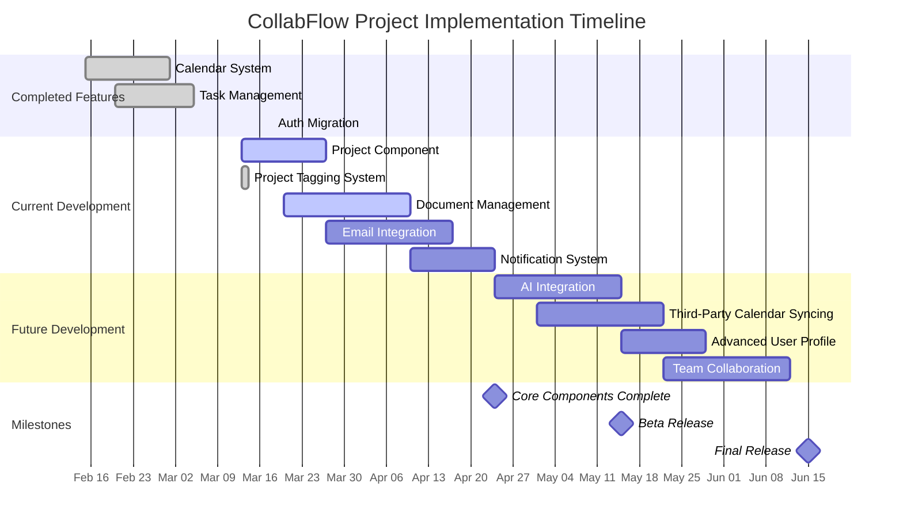

# CollabFlow Progress Tracker

*Last Updated: March 18, 2025*

## What Works

### Core Infrastructure (COMPLETE)

- ✅ Next.js App Router with server-side rendering
- ✅ Supabase integration with proper authentication
- ✅ Role-based access control (RBAC) with admin and user roles
- ✅ Development mode support for testing without authentication
- ✅ Database schema with proper RLS policies
- ✅ API routes for data access and manipulation
- ✅ React Query hooks for data fetching and caching
- ✅ Theme switching with light, dark, and system modes
- ✅ Authentication with @supabase/ssr package (migrated from auth-helpers)
- ✅ Cookie handling for Next.js 15+ compatibility

### Calendar System (COMPLETE)

- ✅ Calendar widget with month view
- ✅ Events list with infinite scrolling
- ✅ Bidirectional synchronization between calendar and events
- ✅ Drag-and-drop event rescheduling
- ✅ Event creation and editing forms
- ✅ Month view with react-day-picker
- ✅ Event indicators as colored dots
- ✅ Outlook-style navigation
- ✅ Recurring events with exception handling
- ✅ Project tagging for events
- ✅ Accessibility improvements:
  - ✅ Added proper dialog titles for screen reader compatibility
  - ✅ Enhanced keyboard navigation for calendar components

### Task Management (COMPLETE)

- ✅ Task creation with title, description, and due date
- ✅ Priority indicators (low, medium, high)
- ✅ Status management (todo, in progress, done)
- ✅ Filtering and sorting capabilities
- ✅ Drag-and-drop task organization
- ✅ Task detail popup with editing capabilities
- ✅ Task list filters and search functionality
- ✅ Project tagging for tasks
- ✅ Task sections by timeframe (Today, Tomorrow, etc.)

### Project Component (First Phase COMPLETE)

- ✅ Dashboard as summary hub for all projects combined
- ✅ Project-specific pages with filtered views
- ✅ Project tagging for tasks, events, documents, etc.
  - ✅ Project database schema with Supabase migrations
  - ✅ Project tag context and hooks for state management
  - ✅ Project selector in task detail popup
  - ✅ Project filtering in task list
  - ✅ Project color indicators in calendar widget
  - ✅ Replaced list tags with project tags for unified organization
- ✅ Project-specific dashboards with similar layout to main dashboard
- ✅ Enhanced sidebar navigation with project list
- ✅ Project creation and management interface
- ✅ Mock data support for development mode

### Document Management (Significant Progress)

- ✅ Authentication Framework
  - ✅ OAuth 2.0 flow with Dropbox API
  - ✅ Token management (access, refresh)
  - ✅ Secure token storage in Supabase
  - ✅ Development mode support with mock data
  - ✅ PKCE implementation for enhanced security
  - ✅ Robust error handling and state validation
  - ✅ Fixed cookie handling for Next.js 15+ compatibility
  - ✅ Updated to @supabase/ssr from deprecated auth-helpers
- ✅ Document Database Schema
  - ✅ Documents table with metadata
  - ✅ Document versions tracking
  - ✅ Document-project associations
  - ✅ Sync logs for tracking operations
- ✅ UI Implementation
  - ✅ Connection UI for Dropbox authentication
  - ✅ Document browsing interface
  - ✅ Project-specific document views
  - ✅ Folder creation dialog
  - ✅ File upload dialog
  - ✅ Enhanced UI layout with cleaner design
  - ✅ Three-dot menu for Projects, Favorites, Refresh, Disconnect
  - ✅ Improved layout alignment with other components
  - ✅ Centralized search bar for better usability
  - ✅ Removed redundant UI elements and descriptive text
- ✅ File Operations
  - ✅ Document upload functionality
  - ✅ Document download functionality
  - ✅ File versioning system
  - ✅ Version history viewer
  - ✅ Document deletion with Dropbox sync
  - ✅ MCP memory integration for document tracking
  - ✅ Real Dropbox API integration (replacing mock data)
  - ✅ Folder creation in Dropbox

### AI Integration (Partial)

- ✅ AI Quick Search with Perplexity API
- ✅ AI Project Assistant in right sidebar
- ✅ AI Messages database schema
- ✅ Custom hooks for AI interactions

## What's Left to Build

### Document Management (In Progress)

- 🔄 Real-time sync worker
- 🔄 Permission mapping to project tags
- 🔄 Document preview functionality
- 🔄 Batch operations for multiple files
- 🔄 Conflict resolution for simultaneous edits

### Project Component (Second Phase)

- 🔄 Project archiving functionality
- 🔄 Advanced project filtering and sorting options
- 🔄 Project statistics and analytics dashboard
- 🔄 Team member assignment to projects

### Email Integration (Planned)

- 📅 Integration with Outlook, Apple Mail, Gmail, etc.
- 📅 Mirror of user's email integrations
- 📅 Email organization and filtering
- 📅 Project-specific email views
- 📅 Email-to-task conversion

### Notification System (Planned)

- 📅 Real-time notifications for events and tasks
- 📅 Email notifications for important updates
- 📅 Notification preferences in user settings
- 📅 Project-specific notification rules

### Enhanced AI Integration (Planned)

- 📅 AI assistants as project experts
- 📅 Context-aware AI recommendations
- 📅 Document analysis capabilities
- 📅 Task-specific AI suggestions

### Third-Party Calendar Syncing (Planned)

- 📅 Integration with Google Calendar
- 📅 Integration with iCloud Calendar
- 📅 Integration with Outlook Calendar
- 📅 Two-way synchronization

### Advanced User Profile Features (Planned)

- 📅 User profile pictures and avatars
- 📅 User activity history and statistics
- 📅 User achievements and gamification
- 📅 User preferences and settings

### Team Collaboration Features (Planned)

- 📅 Shared calendars and task lists
- 📅 Team chat and messaging
- 📅 Permission management
- 📅 Team dashboards and analytics

## Current Status

### Project Component Status

- First phase completed on March 13, 2025
- Performance audit completed (Score: 71/100)
- Core Web Vitals: CLS (0) and TBT (53ms) passed
- LCP optimization needed (currently 5776ms)
- Second phase planned for completion by March 27, 2025

### Document Management Status

- Core infrastructure completed on March 14, 2025
- Authentication issues resolved on March 18, 2025
- UI improvements completed on March 18, 2025
- File operations implementation in progress
- Real-time sync worker planned to start this week
- Estimated completion by April 10, 2025

### Email Integration Status

- Research phase completed
- Architecture design in progress
- Implementation planned to start on March 27, 2025
- Estimated completion by April 17, 2025

## Known Issues

### Performance Issues

1. **Project Component LCP**
   - **Issue**: Largest Contentful Paint (LCP) is 5776ms, above the recommended threshold
   - **Root Causes**: Large JavaScript bundle size, unoptimized image loading, excessive re-renders
   - **Status**: Being addressed with code splitting and memoization
   - **Priority**: High

2. **Calendar Widget Initial Load**
   - **Issue**: Calendar widget takes ~800ms to fully render on initial load
   - **Root Cause**: Complex date calculations and event positioning
   - **Status**: Investigating optimization opportunities
   - **Priority**: Medium

3. **Task List Rendering**
   - **Issue**: Task list with many items can cause jank when scrolling
   - **Root Cause**: Rendering all tasks at once without virtualization
   - **Status**: Planning to implement virtualization
   - **Priority**: Medium

### UI/UX Issues

1. **Form Input Styling in Dark Mode**
   - **Issue**: Text visibility issues in form inputs when using dark mode
   - **Root Cause**: Hardcoded colors in form components
   - **Status**: Fixed in most components, but need to audit all form inputs
   - **Priority**: Medium

2. **Project Color Picker Accessibility**
   - **Issue**: Color picker doesn't provide enough contrast information
   - **Root Cause**: Missing contrast ratio calculation
   - **Status**: Planning to add contrast ratio indicator
   - **Priority**: Low

3. **Mobile Responsiveness**
   - **Issue**: Some components don't adapt well to very small screens
   - **Root Cause**: Fixed width values instead of responsive units
   - **Status**: Needs comprehensive audit and fixes
   - **Priority**: Medium

### Technical Debt

1. **Inconsistent State Management**
   - **Issue**: Mix of React Query, Context, and local state
   - **Root Cause**: Incremental development without consistent patterns
   - **Status**: Planning to standardize approach
   - **Priority**: Medium

2. **Duplicate API Calls**
   - **Issue**: Some components make redundant API calls
   - **Root Cause**: Missing query key normalization in React Query
   - **Status**: Planning to implement query key factory
   - **Priority**: Medium

3. **Missing Error Boundaries**
   - **Issue**: Errors in one component can crash the entire application
   - **Root Cause**: Lack of error boundary implementation
   - **Status**: Planning to add error boundaries to key components
   - **Priority**: High

### Integration Issues (RESOLVED)

1. **Dropbox Token Refresh**
   - **Issue**: ✅ Occasional failures in Dropbox token refresh
   - **Root Cause**: ✅ Race condition in token refresh logic and deprecated auth-helpers
   - **Status**: ✅ Fixed by migrating to @supabase/ssr and updating cookie handling
   - **Priority**: ~~High~~ ✅ Resolved

2. **Project Tag Synchronization**
   - **Issue**: Project tags sometimes don't update immediately across components
   - **Root Cause**: Missing invalidation in React Query cache
   - **Status**: Planning to implement proper cache invalidation
   - **Priority**: Medium

## Key Metrics

- Project tag coverage: ≥ 90% ✅
- Project dashboard navigation performance: < 100ms (Target)
- Project content filtering accuracy: 100% ✅
- Document sync latency: < 200ms (Target)
- Email fetch performance: < 1s (Target)
