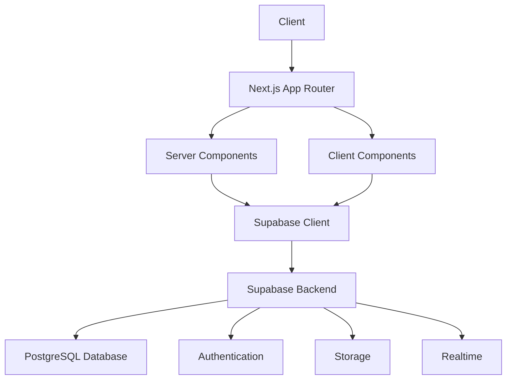
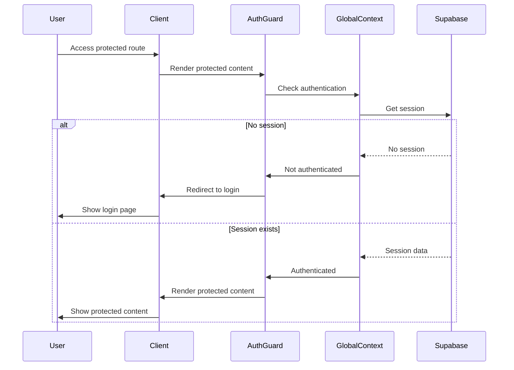
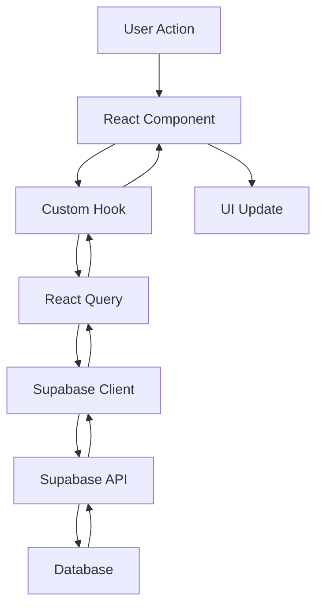
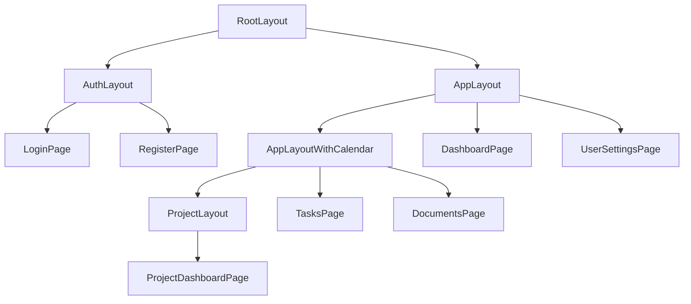
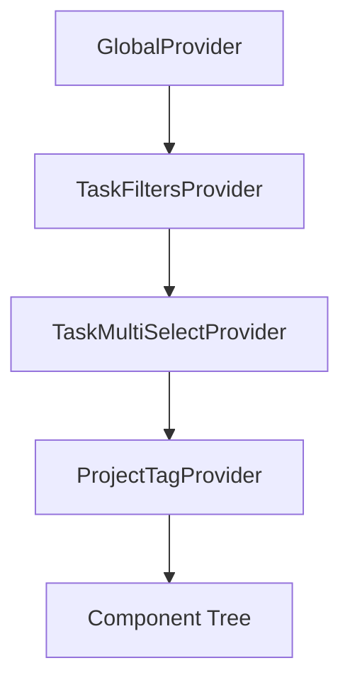
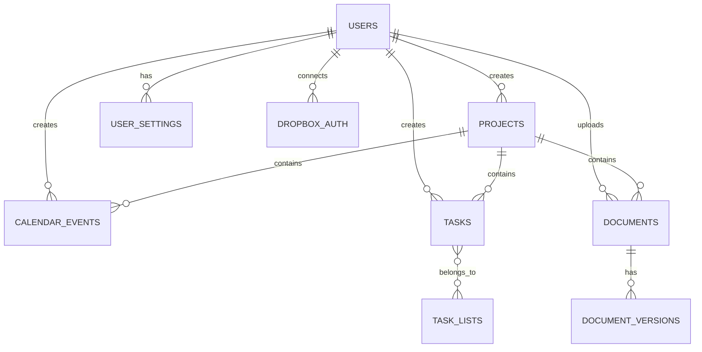

# CollabFlow System Patterns

*Last Updated: March 17, 2025*

## Architecture Overview

CollabFlow follows a modern web application architecture with clear separation of concerns:

## Core Design Patterns

### Component Architecture

CollabFlow uses a component-based architecture with the following patterns:

1. **Container/Presentation Pattern**
   - Container components handle data fetching and state management
   - Presentation components focus on rendering UI
   - Example: `TaskList` (container) and `TaskItem` (presentation)

2. **Context Providers**
   - Global state managed through React Context
   - Providers wrap the application at appropriate levels
   - Example: `GlobalProvider`, `TaskFiltersProvider`, `ProjectTagProvider`

3. **Custom Hooks**
   - Reusable logic extracted into custom hooks
   - Hooks encapsulate data fetching, state management, and side effects
   - Example: `useDocuments`, `useDropboxAuth`, `useProjects`

4. **Server Components**
   - Used for data fetching and initial rendering
   - Reduce client-side JavaScript
   - Example: Layout components, page components

5. **Client Components**
   - Used for interactive elements
   - Marked with "use client" directive
   - Example: Form components, interactive widgets

### Authentication Flow

### Data Flow

## Key Technical Decisions

### 1. Next.js App Router

- **Decision**: Use Next.js App Router instead of Pages Router
- **Rationale**: Better support for server components, improved routing, and layout nesting
- **Implementation**: All routes defined in `app/` directory with nested layouts

### 2. Supabase for Backend

- **Decision**: Use Supabase instead of custom backend
- **Rationale**: Provides authentication, database, storage, and realtime features in one platform
- **Implementation**: Supabase client for data access, RLS policies for security

### 3. React Query for Server State

- **Decision**: Use React Query for server state management
- **Rationale**: Provides caching, background updates, and optimistic updates
- **Implementation**: Custom hooks wrap React Query functionality

### 4. Global Context for Authentication

- **Decision**: Use React Context for global authentication state
- **Rationale**: Provides access to user state throughout the application
- **Implementation**: `GlobalContext` with user state and authentication methods

### 5. Singleton Pattern for Supabase Client

- **Decision**: Use singleton pattern for Supabase client
- **Rationale**: Ensures single instance of Supabase client across the application
- **Implementation**: `clientSingleton.ts` exports a function to get the Supabase client

## Component Relationships

### Layout Structure

### Context Providers Hierarchy

## Database Schema Relationships

## Authentication and Authorization

### Authentication Methods

- Email/password authentication
- Social login (planned)
- Multi-factor authentication (planned)

### Authorization Model

- Row-level security (RLS) policies in Supabase
- User-based ownership of data
- Role-based access control (admin vs. user)

## Error Handling Strategy

1. **Client-Side Validation**
   - Form validation using controlled components
   - Input constraints and feedback

2. **API Error Handling**
   - Try/catch blocks for async operations
   - Error state in custom hooks
   - User-friendly error messages

3. **Global Error Boundary**
   - Catch unhandled errors
   - Fallback UI for error states

## Performance Optimization Techniques

1. **Code Splitting**
   - Dynamic imports for route-based code splitting
   - Lazy loading of components

2. **Memoization**
   - React.memo for expensive components
   - useMemo and useCallback for computed values and functions

3. **Image Optimization**
   - Next.js Image component for optimized images
   - Proper sizing and formats

4. **Virtualization**
   - Virtual lists for long content (events, tasks)
   - Pagination for large datasets

## Testing Strategy

1. **Unit Testing**
   - Component testing with React Testing Library
   - Hook testing with custom test utilities

2. **Integration Testing**
   - API integration tests
   - Component interaction tests

3. **End-to-End Testing**
   - User flow testing with Cypress
   - Authentication and authorization testing
